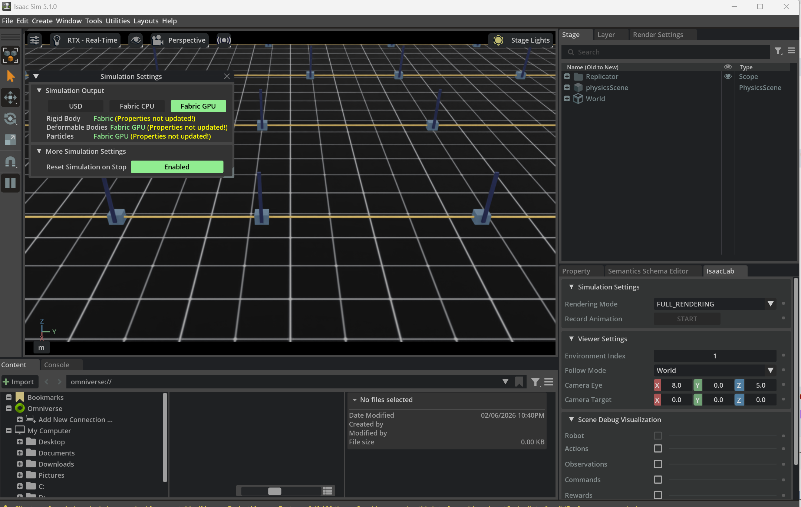
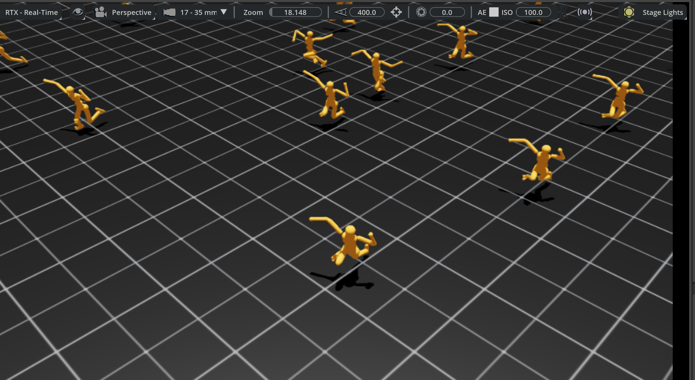

# 仿真世界构建与物理规则

机器人仿真并不是“把几个资产扔进仿真器”那么简单。真正能用于训练、评测、部署迁移的仿真世界，必须同时回答三个问题：

1. **世界是怎么组织的？**
2. **世界遵循什么物理规则？**
3. **这个世界如何被验证、随机化并服务于 Sim2Real？**

这篇笔记讨论的不是单个资产，而是资产如何组成世界。它位于 [仿真资产](仿真资产.md) 之后、[仿真平台](simulation_platforms.md) 之下、[Sim2Real](../04_Robot_Learning/Sim2Real.md) 之前：前者告诉你“零件是什么”，本文告诉你“零件如何拼成一个可运行、可训练、可迁移的宇宙”。

---

## 1. 世界构建总论

### 1.1 什么是“仿真世界”

在具身智能里，世界（World）通常不是单纯的 3D 场景文件，而是以下几个对象的组合：

$$
\text{World} = \text{Scene Graph} + \text{Physics Rules} + \text{Task Logic} + \text{Reset Logic} + \text{Observation Interfaces}
$$

也就是说，一个世界至少要同时定义：

- 哪些实体存在
- 它们如何组织
- 它们如何运动和接触
- 任务何时开始和结束
- 策略能看到什么、能控制什么

### 1.2 世界、场景、任务、episode 的层次

| 概念 | 含义 | 典型例子 |
|------|------|----------|
| World | 最大容器，包含场景、规则、任务接口 | `KitchenPickWorld` |
| Scene | 静态或半静态空间布局 | 厨房台面、仓储通道 |
| Task | 目标定义与成功标准 | `Pick red mug` |
| Episode | 单次 roll-out | 一次从 reset 到 done 的执行 |
| Domain | 参数分布与随机化空间 | 光照、摩擦、噪声分布 |
| Benchmark | 一组标准化任务与评测协议 | LIBERO、RLBench、SIMPLER |

### 1.3 一个“好世界”应满足什么条件

| 维度 | 要求 |
|------|------|
| 正确性 | 物理、坐标、传感器、任务逻辑一致 |
| 稳定性 | 长时间 roll-out 不炸 |
| 可控性 | reset、采样、随机化都可配置 |
| 可复现性 | seed 固定后可复现 |
| 可扩展性 | 能加新资产、新任务、新传感器 |
| 可迁移性 | 能服务 Sim2Real |

### 1.4 从平台视角看世界构建

<!-- SVG-DESIGN-NOTES
Type: A (结构 / 依赖关口链，非等大竖排)
Q0: 世界构建的 7 步不是平等流水线，而是一条强依赖关口链——前一步不达标，后面全部白做（资产没载入正确，物理配置、传感器、奖励全错），世界层因此是最容易被低估却最易整体崩塌的工程层
Q1: 阶梯式下行链，每步是一个"关口"梯形，宽度随依赖累积变窄(越靠后越不容错)；步间用"门控"短横线 + 条件标注表示"必须通过才解锁下一步"；reset/randomization 终点用闭合回流弧表示它反过来压测前面所有步
Q2: 去掉标题：逐级收窄的关口阶梯 + 门控条件 + 终点回流压测弧 = "依赖关口链、世界层易整体崩塌"的命题，7 个等大竖排 box 表达不了"关口/收窄/回流"
Q3: 删掉 7 个等大 rect + 6 直箭头 (480×1000 竖列，渲染只见前 1/3)
Q4: 门控条件标在每段连接处；回流压测语义标在闭合弧上
Q5: 全 var(--dia-*)；关键关口 accent，回流弧 accent 虚线；中英共用
-->
<div class="diagram">
<svg viewBox="0 0 720 360" xmlns="http://www.w3.org/2000/svg" role="img" aria-label="World construction as a dependency gate chain that narrows and loops back">
  <text x="360" y="26" text-anchor="middle" font-family="Fraunces, Georgia, serif" font-style="italic" font-weight="600" font-size="16" fill="var(--dia-stroke)">世界构建 — 强依赖关口链，前一步不达标后面全白做</text>
  <g font-family="Fraunces, Georgia, serif" font-size="11" fill="var(--dia-stroke)">
    <polygon points="60,60 280,60 270,96 70,96" fill="var(--dia-accent)" opacity="0.13" stroke="var(--dia-accent)" stroke-width="1.8"/><text x="170" y="83" text-anchor="middle" font-weight="600">① 仿真平台选定</text>
    <polygon points="80,108 300,108 290,144 90,144" fill="var(--dia-bg-card)" stroke="var(--dia-stroke)" stroke-width="1.4"/><text x="190" y="131" text-anchor="middle">② 资产正确载入</text>
    <polygon points="100,156 320,156 310,192 110,192" fill="var(--dia-bg-card)" stroke="var(--dia-stroke)" stroke-width="1.4"/><text x="210" y="179" text-anchor="middle">③ 世界层次组织</text>
    <polygon points="120,204 340,204 330,240 130,240" fill="var(--dia-accent)" opacity="0.13" stroke="var(--dia-accent)" stroke-width="1.8"/><text x="230" y="227" text-anchor="middle" font-weight="600">④ 物理规则配置</text>
    <polygon points="140,252 360,252 350,288 150,288" fill="var(--dia-bg-card)" stroke="var(--dia-stroke)" stroke-width="1.4"/><text x="250" y="275" text-anchor="middle">⑤ 传感器与观测</text>
    <polygon points="160,300 380,300 370,336 170,336" fill="var(--dia-bg-card)" stroke="var(--dia-stroke)" stroke-width="1.4"/><text x="270" y="323" text-anchor="middle">⑥ 任务逻辑与奖励</text>
  </g>
  <!-- gate conditions between steps -->
  <g font-family="Fraunces, Georgia, serif" font-style="italic" font-size="9.5" fill="var(--dia-stroke-soft)" text-anchor="start">
    <text x="392" y="80">引擎能力 = 物理上限</text>
    <text x="392" y="128">惯量/碰撞代理无误</text>
    <text x="392" y="176">坐标/尺度/单位一致</text>
    <text x="392" y="224">dt·substep·solver 收敛</text>
    <text x="392" y="272">frame 朝向正确</text>
    <text x="392" y="320">reset 干净 + 并行一致</text>
  </g>
  <line x1="386" y1="78" x2="388" y2="78" stroke="var(--dia-stroke-soft)"/>
  <!-- loop-back stress arc: ⑦ reset/randomization re-tests all steps -->
  <ellipse cx="510" cy="200" rx="46" ry="46" fill="none" stroke="var(--dia-accent)" stroke-width="2" stroke-dasharray="5 3"/>
  <text x="510" y="196" text-anchor="middle" font-family="Fraunces, Georgia, serif" font-weight="600" font-size="11" fill="var(--dia-accent-deep)">⑦ reset /</text>
  <text x="510" y="212" text-anchor="middle" font-family="Fraunces, Georgia, serif" font-size="10" fill="var(--dia-accent-deep)">randomization</text>
  <path d="M 556 200 C 620 200 640 140 600 100 C 560 60 440 50 380 60" fill="none" stroke="var(--dia-accent)" stroke-width="1.4" stroke-dasharray="4 3"/>
  <polygon points="380,60 390,54 391,68" fill="var(--dia-accent)"/>
  <text x="600" y="270" text-anchor="middle" font-family="Fraunces, Georgia, serif" font-style="italic" font-size="10" fill="var(--dia-accent-deep)">反复重置压测<tspan x="600" dy="14">前面每一步是否真稳</tspan></text>
</svg>
</div>
<p class="figure-caption">Figure 1 — 世界构建是一条强依赖关口链：每步收窄、需通过门控条件才解锁下一步，reset/randomization 反过来压测前面所有步——这正是世界层最易被低估却最易整体崩塌的原因。</p>


### 1.5 为什么世界层是最容易被低估的工程层

算法工程师常常默认以下前提：

- reset 总是干净的
- 接触总是稳定的
- 相机总是朝对方向
- 同一个任务在并行环境里行为一致

实际项目里，这些都要靠世界层来保证。很多训练结果看上去像是算法差异，实质上是世界层的系统偏差。

---

## 2. 世界组织与层次结构

### 2.1 通用层次结构

一个通用仿真世界通常可以拆成：

<!-- SVG-DESIGN-NOTES
Type: A (结构 / 场景图树，非堆叠方框)
Q0: 一个通用仿真世界是一棵场景图树：World 是根，递归往下 Scene → Entity，Entity 再挂 Component（物理/渲染/传感器）与 Task Hooks（reset/reward）；这棵树的"形状"就是世界组织风格 (USD 树 / MuJoCo worldbody / ECS) 的本质
Q1: 真正的层级树：根节点大、叶子小，按深度缩进；Entity 下分两支——Component 支挂 Physics/Render/Sensor，Task Hooks 支挂 Reset/Reward；用真树枝连接而非等距方框箭头
Q2: 去掉标题：一棵根大叶小、Entity 处二分叉的缩进树 = 场景图组织本质，560×860 等大方框树（且渲染被裁）传达不了"层级深度/分叉"
Q3: 删掉 ~10 等大 rect + 9 直箭头；改为节点半径随深度递减的真树
Q4: 层名贴各节点；Component vs Task Hooks 两支语义直接标在分叉处
Q5: 全 var(--dia-*)；root accent，Component 支 blue，Task Hooks 支 green；中英共用
-->
<div class="diagram">
<svg viewBox="0 0 720 340" xmlns="http://www.w3.org/2000/svg" role="img" aria-label="Simulation world as a scene-graph tree with Component and Task-Hook branches">
  <text x="360" y="26" text-anchor="middle" font-family="Fraunces, Georgia, serif" font-style="italic" font-weight="600" font-size="16" fill="var(--dia-stroke)">仿真世界 = 场景图树，Entity 处分出 Component / Task Hooks 两支</text>

  <!-- tree edges -->
  <g stroke="var(--dia-stroke-soft)" stroke-width="1.4" fill="none">
    <path d="M 360 70 L 360 110"/>
    <path d="M 360 132 L 360 168"/>
    <path d="M 360 190 C 360 215 250 215 250 235"/>
    <path d="M 360 190 C 360 215 480 215 480 235"/>
  </g>
  <!-- Component sub-branch -->
  <g stroke="var(--dia-blue)" stroke-width="1.3" fill="none">
    <path d="M 250 257 C 250 280 150 282 150 300"/>
    <path d="M 250 257 L 250 300"/>
    <path d="M 250 257 C 250 280 350 282 350 300"/>
  </g>
  <!-- Task hooks sub-branch -->
  <g stroke="var(--dia-green)" stroke-width="1.3" fill="none">
    <path d="M 480 257 C 480 280 430 282 430 300"/>
    <path d="M 480 257 C 480 280 560 282 560 300"/>
  </g>

  <!-- nodes: radius shrinks with depth -->
  <circle cx="360" cy="58" r="26" fill="var(--dia-accent)" opacity="0.16"/><circle cx="360" cy="58" r="26" fill="none" stroke="var(--dia-accent)" stroke-width="2.2"/>
  <text x="360" y="62" text-anchor="middle" font-family="Fraunces, Georgia, serif" font-weight="700" font-size="13" fill="var(--dia-accent-deep)">World</text>

  <circle cx="360" cy="121" r="20" fill="var(--dia-bg-card)" stroke="var(--dia-stroke)" stroke-width="1.8"/>
  <text x="360" y="125" text-anchor="middle" font-family="Fraunces, Georgia, serif" font-size="11" fill="var(--dia-stroke)">Scene</text>

  <circle cx="360" cy="179" r="18" fill="var(--dia-bg-card)" stroke="var(--dia-stroke)" stroke-width="1.6"/>
  <text x="360" y="183" text-anchor="middle" font-family="Fraunces, Georgia, serif" font-size="10" fill="var(--dia-stroke)">Entity</text>

  <circle cx="250" cy="246" r="16" fill="var(--dia-bg-card)" stroke="var(--dia-blue)" stroke-width="1.6"/>
  <text x="250" y="250" text-anchor="middle" font-family="Fraunces, Georgia, serif" font-size="9.5" fill="var(--dia-blue)">Component</text>
  <circle cx="480" cy="246" r="16" fill="var(--dia-bg-card)" stroke="var(--dia-green)" stroke-width="1.6"/>
  <text x="480" y="250" text-anchor="middle" font-family="Fraunces, Georgia, serif" font-size="9" fill="var(--dia-green)">Task Hooks</text>

  <g font-family="Fraunces, Georgia, serif" font-size="10" fill="var(--dia-stroke)" text-anchor="middle">
    <circle cx="150" cy="310" r="11" fill="var(--dia-bg-card)" stroke="var(--dia-blue)" stroke-width="1.4"/><text x="150" y="334">Physics</text>
    <circle cx="250" cy="310" r="11" fill="var(--dia-bg-card)" stroke="var(--dia-blue)" stroke-width="1.4"/><text x="250" y="334">Render</text>
    <circle cx="350" cy="310" r="11" fill="var(--dia-bg-card)" stroke="var(--dia-blue)" stroke-width="1.4"/><text x="350" y="334">Sensor</text>
    <circle cx="430" cy="310" r="11" fill="var(--dia-bg-card)" stroke="var(--dia-green)" stroke-width="1.4"/><text x="430" y="334">Reset</text>
    <circle cx="560" cy="310" r="11" fill="var(--dia-bg-card)" stroke="var(--dia-green)" stroke-width="1.4"/><text x="560" y="334">Reward/Success</text>
  </g>
</svg>
</div>
<p class="figure-caption">Figure 2 — 通用仿真世界是一棵场景图树：World→Scene→Entity 递归下行，Entity 处分出 Component（物理/渲染/传感器）与 Task Hooks（reset/reward）两支；树的形状即组织风格本身。</p>


### 2.2 世界组织的常见风格

| 风格 | 代表系统 | 特点 |
|------|----------|------|
| 树状场景图 | USD, Smallville | 层次清晰、组合性强 |
| worldbody 递归体 | MuJoCo | 物理与层次耦合紧密 |
| ECS / component | Unity, 部分仿真引擎 | 解耦性强 |
| 配置驱动 world + task | Isaac Lab, ManiSkill | 与训练流程结合好 |

### 2.3 Smallville 树结构的启示

[虚拟世界仿真引擎](../../05_AI_Agents/07_Virtual_Embodied_Agents/虚拟世界仿真引擎.md) 里的 Smallville 看似是社会仿真，不是机器人平台，但它有一个非常重要的工程思想：**世界不是一张图，而是一棵带语义的树。**

```
World
├── House
│   ├── Kitchen
│   │   ├── Table
│   │   └── Cup
│   └── Bedroom
└── Cafe
```

对机器人仿真也是一样。树结构的好处是：

- 更容易管理局部变换
- 更容易做部分加载
- 更容易做语义继承

### 2.4 USD scene graph

USD 的世界组织优势在于：

- 引用（reference）
- 实例化（instance）
- layer 叠加
- 变换继承

这使得一个世界可以由多个子层拼装：

- 基础建筑层
- 家具布局层
- 机器人层
- 灯光层
- 任务对象层
- 随机化覆盖层

### 2.5 SDF world

SDF 更接近“完整世界定义文件”：

- world
- model
- link
- joint
- light
- physics
- plugin

对 Gazebo 来说，世界构建不仅是摆东西，也是把模拟引擎设置、传感器插件、话题桥接写进统一描述。

### 2.6 MuJoCo worldbody

MuJoCo 的世界组织更强调：

- body 递归层次
- geom 与 joint 的紧耦合
- contact / actuator / sensor 的统一物理视角

它不天然像 USD 那样适合大型协作资产库，但对研究型世界构建非常高效。

### 2.7 组织边界：什么该做成 entity，什么该做成 component

| 对象 | 建议 |
|------|------|
| 机器人 | 独立 entity |
| 抽屉 | 独立 entity，内部再细分部件 |
| 灯光 | 可做成 scene component 或独立 entity |
| 传感器 rig | 通常挂在 entity 上，但作为可复用 component 管理 |
| 任务成功判定 | 不是实体，而是 world/task layer 逻辑 |

### 2.8 世界层次设计 Checklist

| 项目 | 问题 |
|------|------|
| 根坐标系 | 所有对象是否有明确 root frame |
| 命名 | scene graph 名称是否稳定 |
| 组合性 | 新资产能否方便插入 |
| 局部重置 | 是否支持只重置任务对象 |
| 语义标签 | 是否能从层次中恢复语义类别 |

---

## 3. 坐标系与时间系统

### 3.1 为什么坐标系错误比物理错误更常见

训练失败最常见的低级 bug 之一就是 frame 错误：

- 相机 frame 错
- 末端工具坐标错
- 物体 pose 以错误参考系表达
- 奖励函数在 world frame 里算，动作却在 robot frame 下施加

### 3.2 常见坐标系

| 坐标系 | 作用 |
|--------|------|
| `world` | 全局参考 |
| `map` | 长时稳定定位参考 |
| `base_link` | 机器人底座 |
| `tool0` / `tcp` | 末端执行器 |
| `camera_frame` | 相机本体 |
| `camera_optical_frame` | 视觉投影约定 |
| `object_frame` | 物体自身参考 |

### 3.3 变换链

位姿变换的核心关系是：

$$
{}^{A}\mathbf{T}_{C} = {}^{A}\mathbf{T}_{B} \cdot {}^{B}\mathbf{T}_{C}
$$

这在世界构建里几乎无处不在：

- 机器人 base 到 camera
- world 到 object
- table 到 mug
- mug 到 grasp pose

### 3.4 操作任务里常见的 frame 选择

| 任务 | 更推荐的参考系 | 原因 |
|------|----------------|------|
| 末端位姿控制 | robot base / tool frame | 更稳定 |
| 物体抓取 | object frame + tool frame | 便于定义 grasp |
| 导航 | map / world | 便于规划 |
| 多相机融合 | world + camera rig | 便于外参一致性 |

### 3.5 时间系统

除了空间坐标，世界还必须有时间系统：

| 概念 | 说明 |
|------|------|
| simulation time | 仿真时钟 |
| wall-clock time | 实际运行时间 |
| fixed step | 固定物理步长 |
| render step | 渲染频率 |
| sensor step | 传感器刷新频率 |
| control step | 控制输出频率 |

### 3.6 常见时间关系

设：

- 物理步长 $\Delta t_p$
- 控制步长 $\Delta t_c$
- 传感器步长 $\Delta t_s$
- 渲染步长 $\Delta t_r$

通常需要满足：

$$
\Delta t_p \le \min(\Delta t_c, \Delta t_s, \Delta t_r)
$$

否则就会出现控制频率高于状态更新频率、传感器数据与状态不同步等问题。

### 3.7 real-time factor

真实时间因子定义为：

$$
\text{RTF} = \frac{\text{simulated time}}{\text{wall-clock time}}
$$

- `RTF > 1`：仿真比真实时间快
- `RTF = 1`：实时仿真
- `RTF < 1`：仿真拖慢

训练环境希望 `RTF` 尽可能大；人机联调和数字孪生则更关心接近 1。

### 3.8 坐标和时间层的调试手段

| 问题 | 调试方法 |
|------|----------|
| frame 错误 | tf 可视化、绘制坐标轴、手工验证 pose |
| 时间不同步 | 记录时间戳、检查 sensor/control lag |
| optical frame 错误 | 可视化投影方向 |
| render / physics 脱节 | 关闭渲染看物理是否仍异常 |

---

## 4. 刚体动力学基础

### 4.1 本节的边界

本节不重复 [动力学](../03_Robotics/动力学.md) 中的系统推导，而聚焦于“仿真器如何实现一个刚体世界的最小动力学闭环”。

### 4.2 刚体状态

一个刚体最基本的状态包括：

- 位置 $\mathbf{x}$
- 姿态 $\mathbf{R}$ 或四元数 $\mathbf{q}$
- 线速度 $\mathbf{v}$
- 角速度 $\boldsymbol{\omega}$

### 4.3 动力学方程

对刚体的平动，有：

$$
m \dot{\mathbf{v}} = \sum \mathbf{F}
$$

对转动，有：

$$
\mathbf{I}\dot{\boldsymbol{\omega}} + \boldsymbol{\omega} \times (\mathbf{I}\boldsymbol{\omega}) = \sum \boldsymbol{\tau}
$$

对仿真器而言，世界构建者至少要提供：

- 质量
- 惯量
- 外力（含重力）
- 约束和接触

### 4.4 重力不是唯一外力

在世界层里，常见外力来源包括：

- 重力
- 接触力
- 执行器输出
- 弹簧/阻尼
- 风场/流体近似
- 手工扰动（domain randomization / robustness testing）

### 4.5 资产参数如何进入动力学

| 资产字段 | 动力学作用 |
|----------|------------|
| `mass` | 决定平动响应 |
| `inertia` | 决定转动响应 |
| `center_of_mass` | 决定重心和姿态稳定性 |
| `joint damping` | 决定速度耗散 |
| `friction` | 决定接触切向约束 |
| `stiffness` | 决定弹性约束强度 |

### 4.6 自由体和受约束体

| 对象 | 特征 |
|------|------|
| 自由体 | 6-DoF，自由移动 |
| 固定体 | 与世界刚性连接 |
| 关节约束体 | 运动受关节类型限制 |
| 接触体 | 受环境接触条件约束 |

### 4.7 物理世界中的能量视角

训练环境里很多“奇怪抖动”可以从能量角度理解：

- 注入过大驱动力
- 阻尼不足
- 接触解过于刚硬
- 积分器误差导致系统“凭空生能量”

### 4.8 刚体动力学在世界模板中的体现

| 世界模板 | 最关键的刚体问题 |
|----------|------------------|
| 桌面抓取 | 目标物是否稳定站立 |
| 抽屉操作 | 关节和接触耦合 |
| 插拔装配 | 高精度接触和小公差 |
| 四足地形 | 足端接触和本体惯量 |
| 人形搬运 | 大质量载荷和全身稳定性 |

---

## 5. 接触与碰撞规则

### 5.1 为什么接触是世界构建最难的一环

“世界能跑”与“世界可信”之间，最大差距往往就在接触。

物体只要不碰撞，很多问题都简单：

- 刚体积分
- 关节约束
- 视觉观测

一旦涉及：

- 抓取
- 插入
- 堆叠
- 行走触地
- 推动和摩擦

接触规则就成为系统核心。

### 5.2 broad phase 与 narrow phase

<!-- SVG-DESIGN-NOTES
Type: B (几何 / 碰撞检测两相，非流水线方框)
Q0: 碰撞检测分两相是为了避开 O(n²)：broad phase 只用包围盒 (AABB) 快速判"盒子有没有重叠"，把绝大多数显然不接触的 pair 直接剔除；narrow phase 只对幸存 pair 做精确几何 (GJK/EPA) 算出真实接触点与穿透深度，再交给 solver
Q1: 左侧画散布的物体 + 各自 AABB，画出 n(n-1)/2 候选里只有 1-2 对 AABB 真重叠（高亮），其余被剪掉；右侧放大那对重叠物体的真实形状，画出接触法线 n 与穿透深度 d 的几何标注；底部一行注明流向 solver
Q2: 去掉标题：一堆 AABB 中只有少数重叠被保留 + 放大后的接触点/穿透几何 = 两相碰撞检测命题，4 个等大流水线 box（含被裁的 x>900）完全没有"盒子重叠/接触几何"
Q3: 删掉 4 等大 rect + 3 直箭头；改为真 AABB 矩形 + 真物体多边形 + 接触法线/穿透标注
Q4: "AABB 重叠→保留" / "AABB 分离→剪掉" 直接标在对应盒子；n 与 d 标在接触处
Q5: 全 var(--dia-*)；剪掉对 stroke-soft，幸存对 accent，接触法线 green；中英共用
-->
<div class="diagram">
<svg viewBox="0 0 760 320" xmlns="http://www.w3.org/2000/svg" role="img" aria-label="Broad phase AABB pruning then narrow phase exact contact geometry">
  <defs><marker id="bn-arr" markerWidth="9" markerHeight="9" refX="7" refY="3" orient="auto"><path d="M0,0 L0,6 L8,3 z" fill="var(--dia-stroke-soft)"/></marker></defs>
  <text x="380" y="26" text-anchor="middle" font-family="Fraunces, Georgia, serif" font-style="italic" font-weight="600" font-size="16" fill="var(--dia-stroke)">两相碰撞检测 — AABB 粗筛剪掉 O(n²)，再算真实接触几何</text>

  <!-- LEFT: broad phase, AABBs scattered, only one pair overlaps -->
  <text x="200" y="58" text-anchor="middle" font-family="Fraunces, Georgia, serif" font-style="italic" font-size="12" fill="var(--dia-stroke-soft)">Broad Phase — AABB 重叠测试</text>
  <!-- non-overlapping (pruned) -->
  <rect x="70" y="80" width="60" height="46" fill="none" stroke="var(--dia-stroke-soft)" stroke-width="1.2" stroke-dasharray="3 2"/>
  <circle cx="100" cy="103" r="16" fill="var(--dia-bg-card)" stroke="var(--dia-stroke-soft)" stroke-width="1.3"/>
  <rect x="260" y="90" width="56" height="56" fill="none" stroke="var(--dia-stroke-soft)" stroke-width="1.2" stroke-dasharray="3 2"/>
  <polygon points="270,135 288,98 308,135" fill="var(--dia-bg-card)" stroke="var(--dia-stroke-soft)" stroke-width="1.3"/>
  <rect x="120" y="190" width="58" height="50" fill="none" stroke="var(--dia-stroke-soft)" stroke-width="1.2" stroke-dasharray="3 2"/>
  <rect x="132" y="200" width="34" height="30" fill="var(--dia-bg-card)" stroke="var(--dia-stroke-soft)" stroke-width="1.3"/>
  <text x="120" y="262" font-family="Fraunces, Georgia, serif" font-style="italic" font-size="10" fill="var(--dia-stroke-soft)">AABB 分离 → 剪掉 (不进 narrow)</text>
  <!-- overlapping pair (survives) -->
  <rect x="190" y="120" width="64" height="60" fill="var(--dia-accent)" opacity="0.10" stroke="var(--dia-accent)" stroke-width="1.6"/>
  <rect x="226" y="138" width="64" height="56" fill="var(--dia-accent)" opacity="0.10" stroke="var(--dia-accent)" stroke-width="1.6"/>
  <circle cx="224" cy="150" r="20" fill="none" stroke="var(--dia-accent)" stroke-width="1.6"/>
  <rect x="244" y="150" width="36" height="36" fill="none" stroke="var(--dia-accent)" stroke-width="1.6"/>
  <text x="240" y="210" text-anchor="middle" font-family="Fraunces, Georgia, serif" font-style="italic" font-size="10" fill="var(--dia-accent-deep)">AABB 重叠 → 保留</text>

  <path d="M 330 160 C 360 160 380 160 410 160" stroke="var(--dia-stroke-soft)" stroke-width="1.5" marker-end="url(#bn-arr)"/>

  <!-- RIGHT: narrow phase, exact contact -->
  <text x="580" y="58" text-anchor="middle" font-family="Fraunces, Georgia, serif" font-style="italic" font-size="12" fill="var(--dia-stroke-soft)">Narrow Phase — 精确接触几何 (GJK/EPA)</text>
  <circle cx="540" cy="170" r="46" fill="var(--dia-bg-card)" stroke="var(--dia-stroke)" stroke-width="1.8"/>
  <rect x="566" y="138" width="80" height="80" fill="var(--dia-bg-card)" stroke="var(--dia-stroke)" stroke-width="1.8"/>
  <!-- contact point + normal + penetration -->
  <circle cx="582" cy="170" r="4" fill="var(--dia-green)"/>
  <line x1="582" y1="170" x2="620" y2="170" stroke="var(--dia-green)" stroke-width="1.8" marker-end="url(#bn-arr)"/>
  <text x="624" y="166" font-family="JetBrains Mono, monospace" font-size="10" fill="var(--dia-green)">n (接触法线)</text>
  <line x1="566" y1="200" x2="586" y2="200" stroke="var(--dia-accent)" stroke-width="2"/>
  <text x="556" y="222" font-family="JetBrains Mono, monospace" font-size="10" fill="var(--dia-accent-deep)">d (穿透深度)</text>

  <line x1="60" y1="288" x2="700" y2="288" stroke="var(--dia-stroke-soft)" stroke-width="0.8"/>
  <text x="380" y="306" text-anchor="middle" font-family="JetBrains Mono, monospace" font-size="10" fill="var(--dia-stroke-soft)">所有几何体 → broad (AABB 剪枝) → narrow (接触点 n, 穿透 d) → constraint / contact solver</text>
</svg>
</div>
<p class="figure-caption">Figure 3 — 两相碰撞检测：broad phase 用 AABB 重叠测试把 O(n²) 候选对里显然不接触的剪掉，narrow phase 只对幸存对算真实接触点 n 与穿透深度 d，再送进 solver。</p>


Broad phase 常见目标：

- 快速缩小候选 pair
- 减少不必要精确检测

Narrow phase 常见输出：

- 接触点
- 法向
- 穿透深度
- 接触 patch

### 5.3 穿透与约束

接触通常被建模为约束问题。理想情况下，法向穿透应满足：

$$
\phi(\mathbf{x}) \ge 0
$$

其中 $\phi(\mathbf{x})$ 表示物体之间的间隙函数。若 $\phi < 0$，则表示发生穿透。

### 5.4 摩擦锥

接触切向力通常满足摩擦锥约束：

$$
\|\mathbf{f}_t\| \le \mu f_n
$$

其中：

- $\mathbf{f}_t$ 为切向摩擦力
- $f_n$ 为法向接触力
- $\mu$ 为摩擦系数

这就是为什么地面、轮胎、夹爪 pad、物体表面材质设置对仿真效果至关重要。

### 5.5 恢复系数与弹跳

恢复系数决定碰撞后速度反弹程度。过大时会：

- 让桌面物体像球一样弹跳
- 让插入任务变得不真实

过小则：

- 某些需要回弹的任务不自然
- 碰撞显得“黏”

### 5.6 contact offset / rest offset

许多平台允许设置：

- `contact offset`：何时开始认为即将接触
- `rest offset`：稳定接触时允许的接近距离

它们本质上是数值策略，不是现实世界“真实参数”，但对世界稳定性影响极大。

### 5.7 接触规则的工程取舍

| 目标 | 取舍策略 |
|------|----------|
| 更真实 | 更复杂碰撞几何、更细 solver |
| 更稳定 | 更粗碰撞代理、更大 buffer、更高阻尼 |
| 更快 | 更少接触 pair、更低几何复杂度 |
| 更可训练 | 牺牲一部分极端真实性，换可控性 |

### 5.8 典型接触问题

| 问题 | 表现 |
|------|------|
| 卡入/穿透 | 物体互相嵌入 |
| 接触抖动 | 夹持或堆叠时高频振荡 |
| 虚假弹跳 | 轻碰就飞 |
| 摩擦过强 | 推不动或拖不动 |
| 摩擦过弱 | 目标总滑走 |

### 5.9 世界构建中的接触检查

应至少验证：

1. 目标物静置在台面不漂移
2. 手爪闭合后不会瞬间穿透
3. 多物体堆叠不会持续抖动
4. 足端触地不出现非物理弹射

---

## 6. 关节、驱动与约束

### 6.1 关节类型

| 关节类型 | 自由度 | 典型用途 |
|----------|--------|----------|
| Fixed | 0 | 刚性连接 |
| Revolute / Hinge | 1 | 门、机械臂、轮轴 |
| Prismatic | 1 | 滑台、抽屉 |
| Spherical | 3 | 球铰 |
| Planar | 3 | 特殊平面机构 |
| Floating | 6 | 自由基体 |

### 6.2 关节限制

世界层中的 joint limit 通常包含：

- 位置范围
- 速度上限
- 力矩/推力上限
- 软限位或硬限位

如果 limit 不合理：

- 关节超出真实结构
- 强化学习学到非物理动作
- Sim2Real 直接失败

### 6.3 驱动模型

| 驱动类型 | 含义 | 适用 |
|----------|------|------|
| Position drive | 跟踪目标位置 | 工业臂、低速精控 |
| Velocity drive | 跟踪目标速度 | 底盘、滑轨 |
| Torque drive | 直接施加力矩 | 研究和高性能控制 |
| Impedance drive | 位置/速度/力混合 | 接触任务 |

### 6.4 刚度与阻尼

在许多仿真器中，关节驱动可以近似写成：

$$
\tau = K_p (q_d - q) + K_d (\dot{q}_d - \dot{q})
$$

其中：

- $K_p$ 决定刚度
- $K_d$ 决定阻尼

这就是为什么世界构建时“关节参数”和控制理论天然相连。

### 6.5 mimic、tendon 与闭链

有些世界模板不能只靠简单树结构：

- 夹爪双指常需要 mimic
- 绳索和弹簧需要 tendon
- 并联机构和四连杆需要闭链约束

### 6.6 约束类型

| 约束 | 例子 |
|------|------|
| 几何约束 | 球铰、滑轨 |
| 接触约束 | 物体碰撞后不得穿透 |
| 运动学约束 | 闭链机构 |
| 驱动约束 | 电机输出限制 |
| 任务约束 | 末端保持朝向、保持抓持 |

### 6.7 约束越多不一定越好

过度约束会导致：

- 约束冲突
- solver 难收敛
- 系统刚性过强
- 并行环境中偶发爆炸

### 6.8 关节与约束的世界构建检查

| 检查项 | 验证方式 |
|--------|----------|
| 轴向 | 手工转动并观察 |
| limit | 扫描边界姿态 |
| drive | 测 step response |
| mimic/tendon | 联动是否正确 |
| 闭链 | 是否出现约束发散 |

---

## 7. 数值积分与稳定性

### 7.1 为什么“一改 dt 就炸”

很多工程师第一次遇到这个问题会困惑：明明资产没变、控制器没变，只把时间步从 `1/240` 改到 `1/60`，系统就炸了。

这是因为仿真世界不是纯静态描述，而是一个被数值积分器近似求解的动态系统。

### 7.2 常见积分方法

| 积分器 | 特点 |
|--------|------|
| Explicit Euler | 简单、快，但稳定性差 |
| Semi-implicit Euler | 常见于物理引擎，稳定性更好 |
| RK4 | 精度高，但代价更高 |
| Implicit methods | 对刚性系统更稳定 |

### 7.3 最简单的显式 Euler

对状态变量 $x$，显式 Euler 为：

$$
x_{t+1} = x_t + \Delta t \cdot \dot{x}_t
$$

若系统刚性高、$\Delta t$ 过大、驱动力强，这个近似就会快速失真。

### 7.4 Substep 与 solver iteration

世界构建里常见两个稳定性旋钮：

- **substep**：每个控制步里再细分多个物理步
- **solver iteration**：每步里多次迭代约束求解

| 参数 | 增大后通常带来的效果 |
|------|----------------------|
| substep | 更稳定、更慢 |
| solver iteration | 接触更稳、更慢 |
| dt | 更大更快，但更不稳定 |

### 7.5 刚性系统的稳定性来源

最容易引发刚性的是：

- 高刚度关节
- 高硬度接触
- 极小质量物体与大力矩混用
- 非常尖锐的碰撞几何

### 7.6 为什么 RL 环境常用更小 dt

因为 RL 会：

- 探索极端动作
- 在并行环境里放大少数异常
- 长时间 roll-out 累积误差

所以即使 human demo 看起来在粗步长下也能跑，训练环境仍可能需要更细时间步。

### 7.7 数值稳定性的经验规则

| 场景 | 常见建议 |
|------|----------|
| 桌面操作 | 中等 dt + 足够 solver iteration |
| 插拔装配 | 小 dt + 细接触模型 |
| 四足 locomotion | 高频 control + 足端稳定接触 |
| 人形全身控制 | 小 dt + 更严格的 joint 和 contact 调参 |

### 7.8 典型稳定性问题

| 问题 | 根因候选 |
|------|----------|
| 抖动 | dt 大、阻尼小、接触过硬 |
| 爆炸 | 惯量异常、约束冲突、极端 action |
| 慢漂移 | 积分误差、接触残差 |
| 夹持时震荡 | 摩擦/刚度/solver 组合不当 |

### 7.9 稳定性调参顺序

建议顺序：

1. 先查资产质量
2. 再查 dt / substep / solver
3. 再查关节刚度阻尼
4. 最后才查控制器或 RL policy

### 7.10 稳定性 smoke test

<!-- SVG-DESIGN-NOTES
Type: C+B (过程 / 6 个 smoke test 的观测信号小多图)
Q0: 稳定性 smoke test 不是 6 个抽象步骤，而是 6 个各自盯一条可观测曲线的探针：静置看位置漂移应为平线、自由落体看高度应为抛物线、堆叠看穿透应≈0、关节扫描看力矩应有界、重复 reset 看初始态方差应趋零、并行环境看各 env 轨迹应一致——任何一条偏离即暴露物理 bug
Q1: 6 个小面板 (small multiples)，每个面板画该测试的"期望信号 (实线)"vs"失败信号 (虚线偏离)"，配迷你坐标轴；用形状区分稳定/发散
Q2: 去掉标题：6 个各带期望 vs 失败曲线的迷你坐标图 = "每个 smoke test 盯一条可观测量"的命题，6 个等大竖排 box（且渲染被裁）没有任何"信号/曲线"
Q3: 删掉 6 等大 rect + 5 直箭头；改为 6 个迷你 plot，每个含真曲线 + 期望/失败对比
Q4: 每个面板标题贴该测试名；期望 vs 失败直接标在两条曲线旁
Q5: 全 var(--dia-*)；期望 green 实线，失败 accent 虚线；中英共用
-->
<div class="diagram">
<svg viewBox="0 0 760 340" xmlns="http://www.w3.org/2000/svg" role="img" aria-label="Six stability smoke tests, each watching one observable signal">
  <text x="380" y="24" text-anchor="middle" font-family="Fraunces, Georgia, serif" font-style="italic" font-weight="600" font-size="15" fill="var(--dia-stroke)">稳定性 smoke test — 每个测试盯一条可观测信号 (绿=期望, 橙虚=失败)</text>

  <!-- panel 1: static 10s → position drift flat -->
  <g font-family="Fraunces, Georgia, serif" font-size="10.5" fill="var(--dia-stroke)">
  <rect x="40" y="50" width="210" height="120" fill="none" stroke="var(--dia-stroke-soft)" stroke-width="1"/>
  <text x="52" y="68" font-style="italic" font-size="11">静置 10s · 位置漂移</text>
  <line x1="56" y1="150" x2="240" y2="150" stroke="var(--dia-stroke-soft)" stroke-width="0.8"/><line x1="56" y1="80" x2="56" y2="150" stroke="var(--dia-stroke-soft)" stroke-width="0.8"/>
  <path d="M 60 138 L 236 138" stroke="var(--dia-green)" stroke-width="1.8" fill="none"/>
  <path d="M 60 138 C 120 132 180 110 236 86" stroke="var(--dia-accent)" stroke-width="1.4" fill="none" stroke-dasharray="4 3"/>
  <text x="150" y="166" text-anchor="middle" font-size="9" fill="var(--dia-stroke-soft)">期望平线 / 失败漂移</text>

  <!-- panel 2: free fall → parabola -->
  <rect x="275" y="50" width="210" height="120" fill="none" stroke="var(--dia-stroke-soft)" stroke-width="1"/>
  <text x="287" y="68" font-style="italic" font-size="11">自由落体 · 高度</text>
  <line x1="291" y1="150" x2="475" y2="150" stroke="var(--dia-stroke-soft)" stroke-width="0.8"/><line x1="291" y1="80" x2="291" y2="150" stroke="var(--dia-stroke-soft)" stroke-width="0.8"/>
  <path d="M 295 84 C 340 96 400 134 470 148" stroke="var(--dia-green)" stroke-width="1.8" fill="none"/>
  <path d="M 295 84 L 470 148" stroke="var(--dia-accent)" stroke-width="1.4" fill="none" stroke-dasharray="4 3"/>
  <text x="383" y="166" text-anchor="middle" font-size="9" fill="var(--dia-stroke-soft)">期望抛物线 / 失败线性</text>

  <!-- panel 3: contact stack → penetration ≈ 0 -->
  <rect x="510" y="50" width="210" height="120" fill="none" stroke="var(--dia-stroke-soft)" stroke-width="1"/>
  <text x="522" y="68" font-style="italic" font-size="11">接触堆叠 · 穿透量</text>
  <line x1="526" y1="150" x2="710" y2="150" stroke="var(--dia-stroke-soft)" stroke-width="0.8"/><line x1="526" y1="80" x2="526" y2="150" stroke="var(--dia-stroke-soft)" stroke-width="0.8"/>
  <path d="M 530 146 L 706 146" stroke="var(--dia-green)" stroke-width="1.8" fill="none"/>
  <path d="M 530 146 C 580 146 610 100 660 132 C 680 145 695 96 706 120" stroke="var(--dia-accent)" stroke-width="1.4" fill="none" stroke-dasharray="4 3"/>
  <text x="618" y="166" text-anchor="middle" font-size="9" fill="var(--dia-stroke-soft)">期望≈0 / 失败抖动穿模</text>

  <!-- panel 4: joint full sweep → torque bounded -->
  <rect x="40" y="186" width="210" height="120" fill="none" stroke="var(--dia-stroke-soft)" stroke-width="1"/>
  <text x="52" y="204" font-style="italic" font-size="11">关节全范围扫描 · 力矩</text>
  <line x1="56" y1="286" x2="240" y2="286" stroke="var(--dia-stroke-soft)" stroke-width="0.8"/><line x1="56" y1="216" x2="56" y2="286" stroke="var(--dia-stroke-soft)" stroke-width="0.8"/>
  <path d="M 60 270 C 100 255 140 258 180 252 C 210 248 226 256 236 250" stroke="var(--dia-green)" stroke-width="1.8" fill="none"/>
  <path d="M 60 270 C 110 250 150 290 190 224 C 210 280 226 222 236 256" stroke="var(--dia-accent)" stroke-width="1.4" fill="none" stroke-dasharray="4 3"/>
  <text x="150" y="302" text-anchor="middle" font-size="9" fill="var(--dia-stroke-soft)">期望有界 / 失败尖峰发散</text>

  <!-- panel 5: 100x reset → init-state variance → 0 -->
  <rect x="275" y="186" width="210" height="120" fill="none" stroke="var(--dia-stroke-soft)" stroke-width="1"/>
  <text x="287" y="204" font-style="italic" font-size="11">重复 reset 100 次 · 初态方差</text>
  <line x1="291" y1="286" x2="475" y2="286" stroke="var(--dia-stroke-soft)" stroke-width="0.8"/><line x1="291" y1="216" x2="291" y2="286" stroke="var(--dia-stroke-soft)" stroke-width="0.8"/>
  <path d="M 295 240 C 340 280 400 282 470 283" stroke="var(--dia-green)" stroke-width="1.8" fill="none"/>
  <path d="M 295 240 C 340 250 400 244 470 250" stroke="var(--dia-accent)" stroke-width="1.4" fill="none" stroke-dasharray="4 3"/>
  <text x="383" y="302" text-anchor="middle" font-size="9" fill="var(--dia-stroke-soft)">期望趋零 / 失败残留方差</text>

  <!-- panel 6: parallel envs → trajectory agreement -->
  <rect x="510" y="186" width="210" height="120" fill="none" stroke="var(--dia-stroke-soft)" stroke-width="1"/>
  <text x="522" y="204" font-style="italic" font-size="11">并行环境 · 轨迹一致性</text>
  <line x1="526" y1="286" x2="710" y2="286" stroke="var(--dia-stroke-soft)" stroke-width="0.8"/><line x1="526" y1="216" x2="526" y2="286" stroke="var(--dia-stroke-soft)" stroke-width="0.8"/>
  <path d="M 530 270 C 580 250 640 240 706 232" stroke="var(--dia-green)" stroke-width="1.8" fill="none"/>
  <path d="M 530 270 C 580 252 640 270 706 244" stroke="var(--dia-green)" stroke-width="1.2" fill="none" opacity="0.5"/>
  <path d="M 530 270 C 580 230 640 290 706 220" stroke="var(--dia-accent)" stroke-width="1.4" fill="none" stroke-dasharray="4 3"/>
  <text x="618" y="302" text-anchor="middle" font-size="9" fill="var(--dia-stroke-soft)">期望各 env 重合 / 失败发散</text>
  </g>
</svg>
</div>
<p class="figure-caption">Figure 4 — 6 个稳定性 smoke test 各盯一条可观测信号：静置看漂移、落体看抛物线、堆叠看穿透、关节扫描看力矩、重复 reset 看方差、并行 env 看轨迹一致；任一偏离期望即暴露物理 bug。</p>


---

## 8. 传感器仿真规则

### 8.1 传感器规则与资产规则的区别

[仿真资产](仿真资产.md) 讨论的是“传感器对象本身如何建模”。本节讨论的是：

- 它如何采样
- 它如何延迟
- 它如何加噪声
- 它如何和 world/control time 对齐

### 8.2 采样频率

| 传感器 | 常见范围 |
|--------|----------|
| RGB Camera | 10-60 Hz |
| Depth Camera | 10-30 Hz |
| LiDAR | 5-20 Hz |
| IMU | 100-1000 Hz |
| Joint State | 100-1000 Hz |
| Force/Torque | 100-1000 Hz |

### 8.3 延迟模型

延迟可以粗分为：

- 感知延迟
- 通信延迟
- 控制执行延迟

对训练来说，如果这些延迟全省略，world 会比现实“更好控制”，导致部署时策略变脆。

### 8.4 噪声模型

| 传感器 | 噪声来源 |
|--------|----------|
| RGB | 读出噪声、曝光变化、运动模糊 |
| Depth | 空洞、量化、反光失败 |
| LiDAR | beam noise、dropout、多径近似 |
| IMU | bias drift、white noise |
| Encoder | 量化误差、偏置 |
| Force/Torque | 漂移、饱和、低通滤波效应 |

### 8.5 rolling shutter 与 global shutter

如果世界里有高速运动，rolling shutter 会让图像中的几何形变与真实相机更接近。若完全忽略：

- 训练视觉策略可能过于乐观
- 手眼协作的快速动作部署时可能掉性能

### 8.6 深度空洞与透明反光问题

真实 RGB-D 相机常见问题：

- 透明物体深度失败
- 反光金属深度异常
- 边缘空洞
- 远距噪声增大

如果仿真里深度图“无条件完美”，那很多操作策略部署时会受到明显打击。

### 8.7 传感器时序同步

世界层必须决定：

- 相机与 joint state 是否同帧
- depth 是否滞后于 RGB
- IMU 是否高频插值
- 多相机是否严格同步

### 8.8 传感器规则检查清单

| 项目 | 问题 |
|------|------|
| 频率 | 是否符合目标硬件 |
| 延迟 | 是否被建模 |
| 噪声 | 是否存在且可控 |
| 多模态同步 | 是否定义清楚 |
| 数据时间戳 | 是否能回放验证 |

---

## 9. 渲染与视觉世界规则

### 9.1 视觉世界不仅是“看起来好”

渲染规则决定的不只是展示效果，还决定：

- 训练图像分布
- 目标检测难度
- domain gap 大小
- 数据生成可控性

### 9.2 光照模型

| 规则 | 含义 |
|------|------|
| Direct lighting | 直接光照 |
| Indirect / bounce light | 间接反射 |
| Shadow | 阴影规则 |
| Specular highlight | 高光 |
| Ambient / dome | 环境光 |

### 9.3 PBR 与后处理

视觉世界规则常涉及：

- PBR 材质响应
- Bloom
- Tonemapping
- Auto exposure
- Motion blur
- Depth of field

训练里不一定都要开，但要明确开/关的理由。

### 9.4 HDR 与曝光

高动态范围光照和自动曝光对真实感很重要，但也可能把训练输入分布拉得过宽。常见策略：

- 训练时用受控曝光范围
- 评测时再扩大范围

### 9.5 视觉 domain gap 的来源

| 来源 | 例子 |
|------|------|
| 光照 | 现实里顶灯方向和强度经常变 |
| 材质 | 真实表面更脏、更旧、更不均匀 |
| 相机 | 噪声、压缩、模糊、白平衡变化 |
| 背景 | 家庭和工位不会总是干净 |
| 传感器缺陷 | depth 空洞、镜头畸变 |

### 9.6 视觉世界规则中的工程取舍

| 目标 | 做法 |
|------|------|
| 稳定训练 | 限制视觉分布范围 |
| 泛化鲁棒 | 扩大光照/材质/背景随机化 |
| 高保真演示 | 打开高质量渲染和后处理 |
| 大规模并行 | 降低渲染开销，甚至不用图像 |

### 9.7 渲染规则验证

检查项包括：

- 相机视角覆盖是否正确
- 阴影是否遮挡关键目标
- 亮暗对比是否过度
- 透明和反光资产是否表现合理
- 随机化后图像分布是否符合预期

---

## 10. 世界生成方法

### 10.1 手工场景搭建

优点：

- 可控
- 便于调试
- 适合 demo

缺点：

- 多样性差
- 难以规模化
- 人工维护成本高

### 10.2 模板化布局

模板化场景通常固定一类骨架：

- 桌子固定在中心
- 相机 rig 固定在四周
- 目标物从若干 anchor 中采样

这种方式是许多训练环境的主流做法。

### 10.3 程序化生成

程序化生成并不是“随便随机”，而是受约束采样：

$$
x \sim p(x \mid \text{constraints})
$$

约束可包括：

- 物体不能重叠
- 抽屉必须在柜体中
- 相机视野里必须看得到目标
- 起始姿态必须可达

### 10.4 参数化任务组合

| 参数 | 例子 |
|------|------|
| 目标对象 | 红杯子/蓝杯子/盒子 |
| 目标位置 | 左/中/右 |
| 场景布局 | 单桌/双桌/带障碍 |
| 光照 | 顶灯/侧光/背光 |
| 背景干扰 | 有/无其他杂物 |

### 10.5 课程学习式生成

世界生成也可以服务 curriculum：

1. 初期：空场景、少物体、轻扰动
2. 中期：增加光照变化和背景物
3. 后期：加入遮挡、干扰物、复杂接触

### 10.6 资产采样与 placement sampling

核心问题包括：

- 采样哪个资产实例
- 放在哪里
- 朝向如何选
- 是否与其他对象冲突

### 10.7 干扰物采样

很多泛化能力来自干扰物，不是来自目标对象本身。采样干扰物时应考虑：

- 视觉上是否遮挡目标
- 物理上是否阻塞路径
- 语义上是否混淆目标类别

### 10.8 世界生成策略对比

| 方法 | 优点 | 缺点 |
|------|------|------|
| 手工搭建 | 最可控 | 最不 scalable |
| 模板化 | 工程性强 | 多样性有限 |
| 程序化生成 | 覆盖广 | 约束设计复杂 |
| 学习式生成 | 潜力大 | 可控性和可靠性仍是问题 |

{style="display:block; margin:auto; width:850px;"}

*图：世界生成一旦进入批量训练阶段，重点就不再只是“场景里有什么”，而是“如何复制环境、如何统一物理设置、如何让批量 world 可视化和可调试”。这类界面正好对应 world 级组织与批量环境管理。*

---

## 11. Sim2Real 导向的规则设计

### 11.1 为什么世界规则必须为迁移服务

训练世界不是为了“在仿真中赢”，而是为了让策略对真实世界足够稳健。因此很多规则设计要从迁移角度反推。

### 11.2 物理随机化

| 类别 | 常见随机项 |
|------|------------|
| 质量 | 物体质量、负载质量 |
| 摩擦 | 桌面、地面、指尖 pad |
| 关节参数 | damping、stiffness、backlash |
| 接触参数 | restitution、contact offset |
| 延迟 | actuator / sensor latency |

### 11.3 视觉随机化

与 [Sim2Real](../04_Robot_Learning/Sim2Real.md) 中总论一致，世界层真正要落的是：

- 哪些灯光可随机化
- 哪些材质可替换
- 哪些背景层可切换
- 哪些相机参数可扰动

### 11.4 传感器随机化

常见项目：

- 噪声强度
- bias 漂移
- dropout
- 分辨率
- 视场角轻微变化

### 11.5 延迟建模

现实世界中的控制链路通常近似为：

<!-- SVG-DESIGN-NOTES
Type: C (时序 / 控制链路累积延迟，非流水线方框)
Q0: 真实控制链路每一环都引入延迟，关键不是"有这几个环节"而是它们在时间轴上累加成一个总 sensor-to-actuation 滞后 τ_total；世界层若把链路简化成"状态立刻送策略、动作立刻生效"(τ=0)，就产生明显 sim2real 迁移偏差
Q1: 一条时间轴 (ms)，每个阶段画成一段有宽度的色条 (宽度 ∝ 该阶段耗时)，首尾相接累积；顶部用括号标出 τ_total；下方对比一条"理想零延迟"细线说明世界层的常见错误简化
Q2: 去掉标题：时间轴上首尾相接、宽度=耗时的延迟色条 + τ_total 跨度括号 + 零延迟对照 = "延迟在时间轴上累积"的命题，6 个等大方框 + 直箭头（且 x>900 被裁）完全没有"时间/累积"
Q3: 删掉 6 等大 rect + 5 直箭头；改为时间轴 + 宽度编码耗时的延迟条 + τ_total 跨度
Q4: 每段耗时 ms 标在对应色条上；τ_total 标在跨度括号；零延迟错误标在对照线
Q5: 全 var(--dia-*)；各阶段交替 blue/green/accent，理想线 stroke-soft；中英共用
-->
<div class="diagram">
<svg viewBox="0 0 760 300" xmlns="http://www.w3.org/2000/svg" role="img" aria-label="Control loop cumulative latency budget on a time axis">
  <text x="380" y="26" text-anchor="middle" font-family="Fraunces, Georgia, serif" font-style="italic" font-weight="600" font-size="16" fill="var(--dia-stroke)">控制链路延迟 — 各环节在时间轴上累积成总滞后 τ_total</text>

  <!-- time axis -->
  <line x1="60" y1="200" x2="710" y2="200" stroke="var(--dia-stroke)" stroke-width="1.4"/>
  <g font-family="JetBrains Mono, monospace" font-size="10" fill="var(--dia-stroke-soft)" text-anchor="middle">
    <line x1="60" y1="200" x2="60" y2="205"/><text x="60" y="220">0</text>
    <line x1="225" y1="200" x2="225" y2="205"/><text x="225" y="220">15</text>
    <line x1="390" y1="200" x2="390" y2="205"/><text x="390" y="220">30</text>
    <line x1="555" y1="200" x2="555" y2="205"/><text x="555" y="220">45</text>
    <line x1="690" y1="200" x2="690" y2="205"/><text x="690" y="220">~58 ms</text>
  </g>

  <!-- latency bars (width ∝ duration), abutting head-to-tail -->
  <rect x="60" y="150" width="55" height="36" fill="var(--dia-blue)" opacity="0.25" stroke="var(--dia-blue)" stroke-width="1.4"/>
  <text x="87" y="143" text-anchor="middle" font-family="Fraunces, Georgia, serif" font-size="10" fill="var(--dia-blue)">Sensor 采样</text>
  <text x="87" y="172" text-anchor="middle" font-family="JetBrains Mono, monospace" font-size="9" fill="var(--dia-stroke)">5ms</text>

  <rect x="115" y="150" width="120" height="36" fill="var(--dia-green)" opacity="0.22" stroke="var(--dia-green)" stroke-width="1.4"/>
  <text x="175" y="143" text-anchor="middle" font-family="Fraunces, Georgia, serif" font-size="10" fill="var(--dia-green)">感知 / 策略</text>
  <text x="175" y="172" text-anchor="middle" font-family="JetBrains Mono, monospace" font-size="9" fill="var(--dia-stroke)">22ms</text>

  <rect x="235" y="150" width="70" height="36" fill="var(--dia-accent)" opacity="0.2" stroke="var(--dia-accent)" stroke-width="1.4"/>
  <text x="270" y="143" text-anchor="middle" font-family="Fraunces, Georgia, serif" font-size="10" fill="var(--dia-accent-deep)">Controller</text>
  <text x="270" y="172" text-anchor="middle" font-family="JetBrains Mono, monospace" font-size="9" fill="var(--dia-stroke)">8ms</text>

  <rect x="305" y="150" width="95" height="36" fill="var(--dia-blue)" opacity="0.25" stroke="var(--dia-blue)" stroke-width="1.4"/>
  <text x="352" y="143" text-anchor="middle" font-family="Fraunces, Georgia, serif" font-size="10" fill="var(--dia-blue)">Actuator</text>
  <text x="352" y="172" text-anchor="middle" font-family="JetBrains Mono, monospace" font-size="9" fill="var(--dia-stroke)">18ms</text>

  <rect x="400" y="150" width="55" height="36" fill="var(--dia-green)" opacity="0.22" stroke="var(--dia-green)" stroke-width="1.4"/>
  <text x="427" y="143" text-anchor="middle" font-family="Fraunces, Georgia, serif" font-size="10" fill="var(--dia-green)">作用世界</text>
  <text x="427" y="172" text-anchor="middle" font-family="JetBrains Mono, monospace" font-size="9" fill="var(--dia-stroke)">5ms</text>

  <!-- total span bracket -->
  <path d="M 60 110 L 60 100 L 455 100 L 455 110" fill="none" stroke="var(--dia-accent)" stroke-width="1.4"/>
  <text x="257" y="92" text-anchor="middle" font-family="JetBrains Mono, monospace" font-size="12" fill="var(--dia-accent-deep)">τ_total ≈ 58 ms（World State → 下一个 World State）</text>

  <!-- naive zero-latency line for contrast -->
  <line x1="60" y1="252" x2="120" y2="252" stroke="var(--dia-stroke-soft)" stroke-width="2"/>
  <text x="130" y="256" font-family="Fraunces, Georgia, serif" font-style="italic" font-size="10.5" fill="var(--dia-stroke-soft)">世界层若简化为 τ=0（状态立刻送策略、动作立刻生效）→ 明显 sim2real 迁移偏差</text>
</svg>
</div>
<p class="figure-caption">Figure 5 — 真实控制链路每环节在时间轴上累积成总滞后 τ_total≈58ms（采样→感知/策略→控制器→执行器→作用世界）；世界层若简化为零延迟会产生明显 sim2real 偏差。</p>


如果世界层把这条链路简化成“状态立刻送到策略、动作立刻作用”，就会产生明显迁移偏差。

### 11.6 系统辨识与默认参数

随机化不能替代系统辨识。更好的策略往往是：

1. 用系统辨识找到较准的默认参数
2. 围绕默认值做合理随机化

### 11.7 现实差距闭环

世界层应该支持“部署 -> 回收失败样本 -> 回改世界”的闭环。

| 真实失败模式 | 世界层应如何回补 |
|--------------|------------------|
| 光照突变失败 | 增加光照模板 |
| 抓取后滑落 | 扩大摩擦/接触扰动 |
| 深度空洞导致定位错 | 引入 depth artifact |
| 控制滞后 | 注入延迟和执行器动态 |

### 11.8 Sim2Real 设计 Checklist

| 项目 | 问题 |
|------|------|
| 默认参数 | 是否贴近实机 |
| 随机化范围 | 是否覆盖现实变化 |
| 噪声模型 | 是否过于理想 |
| 延迟 | 是否有建模 |
| 失败回流 | 是否有更新机制 |

---

## 12. 平台实现差异

### 12.1 为什么同一世界在不同仿真器里表现不同

同样的机器人、同样的场景、同样的任务逻辑，换个仿真器就可能：

- 接触更稳或更差
- 动作更软或更硬
- 渲染更真或更假
- 训练速度差一到两个数量级

根因不是“文件导错了”，而是平台实现不同。

### 12.2 PhysX vs MuJoCo vs DART/Bullet/ODE vs SAPIEN/PhysX

| 平台/引擎 | 接触风格 | 典型强项 | 典型弱项 |
|-----------|----------|----------|----------|
| PhysX | 工程导向、GPU 支持强 | 大规模场景、NVIDIA 生态 | 研究上可解释性不总是最强 |
| MuJoCo | 接触和约束细节表达强 | 控制、操作、研究迭代 | 大型世界组织能力一般 |
| DART | 多体系统建模好 | ROS/Gazebo 场景 | 大规模并行弱 |
| Bullet/ODE | 历史悠久，兼容广 | 原型和社区支持 | 高精度操作不一定理想 |
| SAPIEN/PhysX | 操作和视觉结合好 | 可交互物体与 benchmark | 通用世界生态稍窄 |

### 12.3 差异块一：接触

不同平台在以下方面差异明显：

- 穿透容忍度
- 摩擦近似方式
- solver 迭代策略
- 静止接触稳定性

### 12.4 差异块二：关节和驱动

| 问题 | 平台差异影响 |
|------|--------------|
| position drive 行为 | 不同平台 PD 实现不同 |
| torque saturation | 饱和方式和裁剪时机不同 |
| mimic/tendon 支持 | 表达能力不同 |

### 12.5 差异块三：传感器

| 维度 | 差异 |
|------|------|
| RGB 渲染 | 材质和光照支持差异 |
| Depth | 空洞和噪声模拟差异 |
| LiDAR | beam model 与性能差异 |
| Contact sensor | 支持粒度差异 |

### 12.6 差异块四：世界组织

| 平台 | 更自然的世界构建风格 |
|------|----------------------|
| Isaac Sim | USD 场景层叠 |
| MuJoCo | 物理研究 worldbody |
| Gazebo | SDF world + plugin |
| ManiSkill/SAPIEN | 配置驱动任务环境 |

### 12.7 平台差异意味着什么

世界层应避免把平台特性硬编码得太死。更好的做法是抽象出：

- 资产接口
- 任务接口
- 随机化接口
- 评测接口

平台相关部分尽量局限在适配层。

---

## 13. 世界验证与基准

### 13.1 验证什么

仿真世界至少需要验证四件事：

1. 物理是否稳定
2. 任务是否可执行
3. 数据是否可信
4. 评测是否可复现

### 13.2 验证层次

| 层次 | 验证问题 |
|------|----------|
| 单资产 | 物体是否站得住、关节是否能动 |
| 单场景 | world reset 是否正常 |
| 单任务 | 成功条件是否正确 |
| 多任务套件 | 难度和分布是否合理 |
| Sim2Real | 是否能解释真实失败模式 |

### 13.3 核心指标

| 指标 | 含义 |
|------|------|
| Success Rate | 任务成功率 |
| Stability Score | 长时间无爆炸比例 |
| Reset Reliability | reset 后可重复进入有效初始状态的比例 |
| Contact Robustness | 接触任务稳定性 |
| Trajectory Reproducibility | 同 seed 轨迹一致性 |
| Runtime / RTF | 性能指标 |

### 13.4 回放与可视化

世界验证必须支持：

- 单步回放
- 慢动作重播
- 关键 frame 导出
- 接触点可视化
- frame tree 可视化
- 传感器时间戳对齐检查

### 13.5 Benchmark 的意义

Benchmark 不是简单“给 10 个任务”。它本质上是在定义：

- 世界分布
- 成功标准
- 难度增长
- 比较协议

例如：

- `LIBERO` 更关注知识迁移与长期学习
- `SIMPLER` 更关注仿真评测与真实部署相关性
- `RLBench` 更关注操作技能覆盖

### 13.6 世界验证 Checklist

| 项目 | 问题 |
|------|------|
| reset | 是否无残留状态 |
| 接触 | 是否长时间稳定 |
| 指标 | 是否可自动记录 |
| 回放 | 是否能复盘失败 |
| seed | 是否可复现 |
| benchmark split | 是否避免 train/test 泄漏 |

---

## 14. 典型世界模板

### 14.1 桌面抓取世界

| 组成 | 内容 |
|------|------|
| 资产组合 | 机械臂、夹爪、桌子、目标物、背景板、相机 |
| 规则重点 | 抓取接触、摩擦、相机视角 |
| 常见失败 | 物体滑走、抓后穿透、视觉遮挡 |

### 14.2 抽屉开合世界

| 组成 | 内容 |
|------|------|
| 资产组合 | 柜体、抽屉、把手、机械臂、腕部相机 |
| 规则重点 | prismatic joint、把手 affordance、接触稳定性 |
| 常见失败 | 轴向错、抽屉卡死、把手不可达 |

### 14.3 插拔装配世界

| 组成 | 内容 |
|------|------|
| 资产组合 | 插头、插座、夹持器、定位治具 |
| 规则重点 | 小公差、细接触、力觉/接触反馈 |
| 常见失败 | 穿透、卡边、需要极小 dt |

### 14.4 四足地形世界

| 组成 | 内容 |
|------|------|
| 资产组合 | 四足机器人、地面、坡道、楼梯、障碍 |
| 规则重点 | 足端接触、地形摩擦、高频控制 |
| 常见失败 | 地形不连贯、触地弹跳、局部爆炸 |

### 14.5 人形搬运世界

| 组成 | 内容 |
|------|------|
| 资产组合 | 人形机器人、箱体、工位、障碍、多个相机 |
| 规则重点 | 全身平衡、接触切换、自碰撞 |
| 常见失败 | 负载过重导致不稳、双手抓持不一致 |

### 14.6 移动导航世界

| 组成 | 内容 |
|------|------|
| 资产组合 | 地图、墙体、门、障碍物、LiDAR/相机、底盘 |
| 规则重点 | 全局地图、局部避障、传感器频率 |
| 常见失败 | map/odom 对不齐、动态障碍处理不真实 |

### 14.7 世界模板的复用方式

一个好的模板应支持：

- 换资产实例
- 换光照
- 换观测组合
- 换任务目标
- 换成功标准

---

## 15. 开发流程与检查清单

### 15.1 从空世界到 benchmark 的工程流程

<!-- SVG-DESIGN-NOTES
Type: C+E (过程 / 迭代螺旋 + 阶段分期，非等大竖排)
Q0: 从空世界做到 benchmark 不是一次走完的 10 步直线，而是一个螺旋：首轮搭出 v1，"回收真实失败样本"把你拽回前面阶段做 v2、v3——每一圈都更接近现实，benchmark 是螺旋逐渐收敛的结果而非终点
Q1: 螺旋线从外向内绕，10 个里程碑节点沿螺旋分布；三段相位带 (定义/构建/验证迭代) 用色弧标注；闭合处"回收失败样本→重做"用强调色回旋臂连回前段，体现"多轮收敛"
Q2: 去掉标题：一条向内收敛的螺旋 + 失败样本回旋臂 + 分期色弧 = "多轮迭代逐渐逼近现实"的命题，480×1560 等大竖排 box（渲染只见 1/3）只能表达单向直线
Q3: 删掉 10 等大 rect + 9 直箭头；改为螺旋路径 + 节点 + 回旋臂 + 相位弧
Q4: 阶段名贴螺旋各节点；"回收真实失败样本并迭代"标在回旋臂
Q5: 全 var(--dia-*)；三相位 blue/gold/green，回旋臂 accent；中英共用
-->
<div class="diagram">
<svg viewBox="0 0 620 430" xmlns="http://www.w3.org/2000/svg" role="img" aria-label="Empty world to benchmark as a converging iteration spiral">
  <defs><marker id="sp-arr" markerWidth="9" markerHeight="9" refX="7" refY="3" orient="auto"><path d="M0,0 L0,6 L8,3 z" fill="var(--dia-accent)"/></marker></defs>
  <text x="310" y="26" text-anchor="middle" font-family="Fraunces, Georgia, serif" font-style="italic" font-weight="600" font-size="16" fill="var(--dia-stroke)">空世界 → benchmark — 多轮迭代螺旋，失败样本拽你回前段</text>

  <!-- converging spiral guide -->
  <path d="M 310 70 C 470 80 530 200 470 300 C 420 380 250 400 180 320 C 130 260 150 190 230 175 C 290 165 330 200 320 240" fill="none" stroke="var(--dia-stroke-soft)" stroke-width="0.9" stroke-dasharray="3 4"/>

  <!-- phase arcs -->
  <text x="430" y="70" font-family="Fraunces, Georgia, serif" font-style="italic" font-size="11" fill="var(--dia-blue)">定义阶段</text>
  <text x="500" y="320" font-family="Fraunces, Georgia, serif" font-style="italic" font-size="11" fill="var(--dia-gold)">构建阶段</text>
  <text x="150" y="370" font-family="Fraunces, Georgia, serif" font-style="italic" font-size="11" fill="var(--dia-green)">验证迭代阶段</text>

  <!-- 10 milestone nodes along spiral -->
  <g font-family="Fraunces, Georgia, serif" font-size="10" fill="var(--dia-stroke)">
    <circle cx="310" cy="70" r="5" fill="var(--dia-blue)"/><text x="318" y="62">① 定义任务目标</text>
    <circle cx="420" cy="92" r="5" fill="var(--dia-blue)"/><text x="430" y="92">② 选平台/资产格式</text>
    <circle cx="492" cy="170" r="5" fill="var(--dia-gold)"/><text x="502" y="170">③ 导入资产</text>
    <circle cx="500" cy="262" r="5" fill="var(--dia-gold)"/><text x="510" y="264">④ 建场景层次</text>
    <circle cx="450" cy="330" r="5" fill="var(--dia-gold)"/><text x="460" y="338">⑤ 配置物理规则</text>
    <circle cx="350" cy="372" r="5" fill="var(--dia-gold)"/><text x="356" y="392">⑥ 绑传感器/观测</text>
    <circle cx="240" cy="362" r="5" fill="var(--dia-green)"/><text x="120" y="382">⑦ 任务/reset/reward</text>
    <circle cx="178" cy="300" r="5" fill="var(--dia-green)"/><text x="60" y="300">⑧ smoke test</text>
    <circle cx="190" cy="222" r="5" fill="var(--dia-green)"/><text x="70" y="218">⑨ 随机化/稳定性测试</text>
    <circle cx="262" cy="186" r="5" fill="var(--dia-green)"/><text x="200" y="172">⑩ 接入训练与评测</text>
  </g>

  <!-- failure-sample re-loop arm (accent) -->
  <path d="M 290 200 C 340 250 360 290 320 330 C 290 360 240 360 215 330" fill="none" stroke="var(--dia-accent)" stroke-width="2" stroke-dasharray="5 3" marker-end="url(#sp-arr)"/>
  <text x="310" y="270" text-anchor="middle" font-family="Fraunces, Georgia, serif" font-weight="600" font-style="italic" font-size="10.5" fill="var(--dia-accent-deep)">回收真实失败样本</text>
  <text x="310" y="285" text-anchor="middle" font-family="Fraunces, Georgia, serif" font-style="italic" font-size="10" fill="var(--dia-accent-deep)">→ 拽回前段做下一轮</text>
</svg>
</div>
<p class="figure-caption">Figure 6 — 从空世界到 benchmark 是一条逐渐收敛的迭代螺旋：每圈搭出一版，"回收真实失败样本"把工程师拽回前面阶段做下一轮，benchmark 是螺旋收敛的产物而非一次性终点。</p>


{style="display:block; margin:auto; width:820px;"}

*图：在工程上，“世界”常常不是单个场景，而是一批并行复制的 episode 容器。训练框架真正关心的是这些 world 是否能稳定 reset、稳定 rollout、稳定记录指标。*

### 15.2 推荐开发节奏

1. 先做一个最小世界，只保留关键资产和关键接触。
2. 先让 reset 稳定，再谈训练。
3. 先在单环境下做长时间 roll-out，再扩并行。
4. 先验证指标和回放，再引入复杂随机化。

### 15.3 CI / Smoke Test 应包含什么

| 类别 | 建议测试 |
|------|----------|
| 加载 | 世界是否能无报错初始化 |
| reset | 连续 100 次 reset 是否稳定 |
| 控制 | 随机 action 下是否爆炸 |
| 传感器 | topic / buffer / timestamp 是否正常 |
| 指标 | reward / success / done 是否可记录 |
| 回放 | 是否能导出关键调试信息 |

### 15.4 错误案例一：世界配置错误导致训练学偏

**现象：**

- 桌面抓取在仿真中成功率很高
- 真机一抓就滑落

**根因：**

- 世界层把夹爪 pad 摩擦设置得过高
- 目标物碰撞代理过粗
- 真实相机延迟没有建模

**修复：**

- 回调物理参数
- 增加视觉和延迟随机化
- 用真实失败样本回补 world 设计

### 15.5 错误案例二：时间系统错误导致部署抖动

**现象：**

- 仿真 locomotion 非常平滑
- 真机控制出现滞后与过冲

**根因：**

- 仿真 control step 和 sensor step 理想同步
- 未建模 actuator delay
- IMU 噪声和 bias 过于理想

**修复：**

- 引入异步与延迟
- 加入 IMU drift
- 重测实机链路延迟并回灌世界参数

### 15.6 最终检查清单

| 检查项 | 是否明确 |
|--------|----------|
| 世界层次 | world/scene/entity/task 是否清楚 |
| 坐标系 | frame 链是否一致 |
| 时间系统 | dt、substep、sensor rate 是否文档化 |
| 接触规则 | 摩擦、恢复系数、solver 参数是否可追踪 |
| 关节驱动 | 控制模式和限制是否合理 |
| 传感器 | 噪声、延迟、同步是否定义 |
| 随机化 | 范围是否覆盖部署变化 |
| 验证 | smoke test 和 benchmark 是否存在 |

---

## 16. 与其他章节的关系

- 平台选型和定位，见 [仿真平台](simulation_platforms.md)。
- 资产本体如何制作和导入，见 [仿真资产](仿真资产.md)。
- 格式基础和开发工具，见 [开发工具链](开发工具链.md)。
- 随机化、系统辨识和迁移总论，见 [Sim2Real](../04_Robot_Learning/Sim2Real.md)。
- 动力学和控制的理论基础，见 [动力学](../03_Robotics/动力学.md) 与 [控制理论](../03_Robotics/控制理论.md)。
- 若关心学习式世界模型和生成式仿真，可继续看 [世界模型与视频生成](../05_Models/世界模型与视频生成.md) 与 [空间智能与学习式仿真](../../01_AI/03_Frontiers/03_World_Models/空间智能与学习式仿真.md)。

---

## 17. 参考文献与延伸阅读

- NVIDIA Isaac Sim / Isaac Lab documentation.
- MuJoCo documentation and contact model references.
- Open Robotics SDFormat documentation.
- SAPIEN / ManiSkill documentation.
- PhysX documentation.
- LIBERO, RLBench, SIMPLER, ManiSkill benchmark papers.
- [仿真资产](仿真资产.md)
- [仿真平台](simulation_platforms.md)
- [Sim2Real](../04_Robot_Learning/Sim2Real.md)

---

## 18. 附录：典型参数经验表与工程实践

### 18.1 为什么仍然需要经验参数表

理论上，最理想的世界参数应来自：

- 真实系统辨识
- 真实传感器标定
- 高保真接触建模

但在项目初期，工程团队通常仍需要一个“能让世界先跑起来”的经验起点。经验参数表的作用不是替代理论，而是提供：

- 初始默认值
- 调参方向
- 排错边界

### 18.2 桌面操作世界的经验参数

| 项目 | 经验建议 | 说明 |
|------|----------|------|
| 物理步长 | 小于控制步长的 1/2 到 1/8 | 接触任务通常需要更细时间分辨率 |
| 子步数 | 2-8 | 抓取和堆叠时常见 |
| 桌面摩擦 | 中等偏高 | 过低容易滑走，过高会掩盖真实问题 |
| 物体恢复系数 | 低到中等 | 多数日用品不应明显弹跳 |
| 夹爪 pad 摩擦 | 不宜过高 | 否则策略会学到不现实抓取 |
| 相机频率 | 15-30 Hz | 与真实 RGB-D 设备接近 |
| 腕部相机延迟 | 非零 | 避免“完美感知” |

### 18.3 插拔装配任务的经验参数

| 项目 | 经验建议 | 风险 |
|------|----------|------|
| 几何公差 | 不要一开始就极限精度 | 先用可学习版本，再逐步收紧 |
| contact offset | 比普通抓取更精细 | 太粗会让插入“穿模式成功” |
| solver iteration | 较高 | 否则高刚性接触不稳定 |
| 执行器速度 | 适中 | 过快会导致撞击和发散 |
| 力觉/接触反馈 | 建议建模 | 完全无反馈会使训练难以泛化 |

### 18.4 四足和人形世界的经验参数

| 项目 | 四足 | 人形 |
|------|------|------|
| 控制频率 | 高 | 很高 |
| 足/脚底接触 | 必须稳定 | 必须稳定 |
| 地形多样性 | 强依赖 | 中到强依赖 |
| 自碰撞 | 中等重要 | 极其重要 |
| 负载变化 | 次要 | 较重要 |

### 18.5 视觉世界的经验设计

| 项目 | 建议 |
|------|------|
| 训练初期灯光 | 先少量模板，再逐步加大随机化 |
| 背景干扰 | 初期适度，后期扩大 |
| 相机曝光 | 不要默认固定不变 |
| 材质库 | 先建立标准材质族，再做替换 |
| 透明/反光资产 | 单独测，不要直接混入主 benchmark |

### 18.6 传感器调度矩阵

| 模态 | 高频控制需要 | 视觉操作需要 | 导航需要 |
|------|--------------|--------------|----------|
| Joint State | 高 | 中高 | 中 |
| IMU | 高 | 中 | 高 |
| RGB | 低 | 高 | 中 |
| Depth | 低到中 | 高 | 中 |
| LiDAR | 低 | 低 | 高 |
| Force/Torque | 中 | 高 | 低 |

### 18.7 reset 策略模式库

世界层里的 reset 不是单一函数，而是一套策略。

| reset 模式 | 用途 | 风险 |
|------------|------|------|
| Hard Reset | 全部对象回初始状态 | 成本高但最干净 |
| Partial Reset | 只重置任务对象 | 可能遗留隐藏状态 |
| Lazy Reset | 批量环境按需重置 | 管理逻辑更复杂 |
| Curriculum Reset | 难度随训练阶段变化 | 需要额外状态机 |

### 18.8 reset 设计中的三个隐性问题

1. **速度是否归零**：很多系统只重置位姿，不清零速度。
2. **缓存是否清理**：传感器缓存、动作历史、RNN 隐状态常被遗漏。
3. **语义状态是否同步**：门关上了，但 `is_open` 还留在上一轮状态。

### 18.9 世界 profiling 的观察维度

<!-- SVG-DESIGN-NOTES
Type: D (量化 / 每步耗时预算分解，非分类树)
Q0: 世界 profiling 的本质是测量——一个仿真步的 wall-clock 时间预算被 Physics / Rendering / Sensor / Reset / Task Logic 五大块按不同比例瓜分，而每块又能下钻到具体子项 (Physics→contact pairs/solver iters)；优化要先看哪块占比最大，而不是凭感觉
Q1: 一根水平堆叠条 = 100% 单步时间，五段宽度 ∝ 实测占比；下方对每个大块画一个迷你子项条 (下钻)，子项条长度 ∝ 子项贡献；用真百分比刻度轴
Q2: 去掉标题：一根按实测比例瓜分的堆叠时间条 + 子项下钻条 + 百分比轴 = "profiling 是量化分解、先看占比最大块"的命题，560×1000 分类树（且渲染被裁）没有任何"比例/量"
Q3: 删掉 ~14 等大 rect + 14 直箭头；改为堆叠百分比条 + 子项下钻条 + 刻度轴
Q4: 每段百分比标在段内；子项贡献标在子项条旁
Q5: 全 var(--dia-*)；五大块 accent/green/blue/gold/stroke 区分；中英共用
-->
<div class="diagram">
<svg viewBox="0 0 760 360" xmlns="http://www.w3.org/2000/svg" role="img" aria-label="World profiling: per-step time budget broken down by cost category">
  <text x="380" y="26" text-anchor="middle" font-family="Fraunces, Georgia, serif" font-style="italic" font-weight="600" font-size="16" fill="var(--dia-stroke)">世界 profiling — 单步时间预算按实测占比瓜分，先打最大块</text>

  <!-- percentage axis -->
  <line x1="60" y1="100" x2="700" y2="100" stroke="var(--dia-stroke)" stroke-width="1.2"/>
  <g font-family="JetBrains Mono, monospace" font-size="10" fill="var(--dia-stroke-soft)" text-anchor="middle">
    <line x1="60" y1="100" x2="60" y2="95"/><text x="60" y="86">0%</text>
    <line x1="220" y1="100" x2="220" y2="95"/><text x="220" y="86">25%</text>
    <line x1="380" y1="100" x2="380" y2="95"/><text x="380" y="86">50%</text>
    <line x1="540" y1="100" x2="540" y2="95"/><text x="540" y="86">75%</text>
    <line x1="700" y1="100" x2="700" y2="95"/><text x="700" y="86">100%</text>
  </g>

  <!-- stacked bar = one sim step, widths ∝ measured share -->
  <rect x="60" y="110" width="282" height="40" fill="var(--dia-accent)" opacity="0.28" stroke="var(--dia-accent)" stroke-width="1.4"/>
  <text x="201" y="135" text-anchor="middle" font-family="Fraunces, Georgia, serif" font-size="11" fill="var(--dia-accent-deep)">Physics 44%</text>
  <rect x="342" y="110" width="160" height="40" fill="var(--dia-green)" opacity="0.25" stroke="var(--dia-green)" stroke-width="1.4"/>
  <text x="422" y="135" text-anchor="middle" font-family="Fraunces, Georgia, serif" font-size="11" fill="var(--dia-green)">Render 25%</text>
  <rect x="502" y="110" width="115" height="40" fill="var(--dia-blue)" opacity="0.25" stroke="var(--dia-blue)" stroke-width="1.4"/>
  <text x="559" y="135" text-anchor="middle" font-family="Fraunces, Georgia, serif" font-size="10" fill="var(--dia-blue)">Sensor 18%</text>
  <rect x="617" y="110" width="51" height="40" fill="var(--dia-gold)" opacity="0.3" stroke="var(--dia-gold)" stroke-width="1.4"/>
  <text x="642" y="135" text-anchor="middle" font-family="Fraunces, Georgia, serif" font-size="8.5" fill="var(--dia-gold)">Reset 8%</text>
  <rect x="668" y="110" width="32" height="40" fill="none" stroke="var(--dia-stroke)" stroke-width="1.4"/>
  <text x="684" y="135" text-anchor="middle" font-family="Fraunces, Georgia, serif" font-size="8" fill="var(--dia-stroke-soft)">Task 5%</text>

  <!-- drill-down sub-bars -->
  <text x="60" y="184" font-family="Fraunces, Georgia, serif" font-style="italic" font-size="11" fill="var(--dia-stroke-soft)">下钻：最大块 Physics 的内部构成</text>
  <g font-family="Fraunces, Georgia, serif" font-size="10" fill="var(--dia-stroke)">
    <text x="60" y="210">Contact pairs</text><rect x="200" y="200" width="240" height="14" fill="var(--dia-accent)" opacity="0.3"/><text x="450" y="211" font-family="JetBrains Mono, monospace" font-size="9" fill="var(--dia-stroke-soft)">~52% of physics</text>
    <text x="60" y="232">Solver iterations</text><rect x="200" y="222" width="150" height="14" fill="var(--dia-accent)" opacity="0.3"/><text x="360" y="233" font-family="JetBrains Mono, monospace" font-size="9" fill="var(--dia-stroke-soft)">~33%</text>
    <text x="60" y="254">Narrow-phase geom</text><rect x="200" y="244" width="70" height="14" fill="var(--dia-accent)" opacity="0.3"/><text x="280" y="255" font-family="JetBrains Mono, monospace" font-size="9" fill="var(--dia-stroke-soft)">~15%</text>
  </g>
  <text x="60" y="288" font-family="Fraunces, Georgia, serif" font-style="italic" font-size="11" fill="var(--dia-stroke-soft)">下钻：Render 的内部构成</text>
  <g font-family="Fraunces, Georgia, serif" font-size="10" fill="var(--dia-stroke)">
    <text x="60" y="314">Resolution</text><rect x="200" y="304" width="190" height="14" fill="var(--dia-green)" opacity="0.3"/><text x="400" y="315" font-family="JetBrains Mono, monospace" font-size="9" fill="var(--dia-stroke-soft)">~46% of render</text>
    <text x="60" y="336">Lighting/PostFX</text><rect x="200" y="326" width="130" height="14" fill="var(--dia-green)" opacity="0.3"/><text x="340" y="337" font-family="JetBrains Mono, monospace" font-size="9" fill="var(--dia-stroke-soft)">~32%</text>
  </g>
</svg>
</div>
<p class="figure-caption">Figure 7 — 世界 profiling 把单步时间按实测占比瓜分 (Physics 44% / Render 25% / Sensor 18% / Reset 8% / Task 5%)，再下钻到子项 (Physics→contact pairs/solver)；优化先打占比最大的块。</p>


### 18.10 常见 profiling 结论

| 现象 | 更可能的瓶颈 |
|------|--------------|
| GPU 占满但 FPS 低 | 渲染、相机、点云 |
| CPU 占高且 step 慢 | scene 管理、奖励逻辑、插件 |
| physics 明显变慢 | 接触 pair 太多、碰撞几何过密 |
| reset 比 step 还慢 | 采样器、资产加载、Python 逻辑 |

### 18.11 性能调优顺序

建议顺序如下：

1. 先减少碰撞复杂度
2. 再减少渲染成本
3. 再检查传感器频率
4. 最后才考虑牺牲物理精度

### 18.12 多平台迁移时的世界适配表

| 从 | 到 | 重点检查 |
|----|----|----------|
| URDF/Gazebo | Isaac Sim/USD | 坐标轴、材质、传感器桥接 |
| MJCF | Isaac Sim | 关节驱动、接触参数、mesh 转换 |
| USD | MuJoCo | 层次表达、传感器、材质降级 |
| SAPIEN | MuJoCo | 物体交互规则、相机接口 |

### 18.13 平台迁移 Checklist

| 项目 | 问题 |
|------|------|
| 单位 | 是否一致 |
| frame | 根坐标和 optical frame 是否一致 |
| 材质 | 是否需要降级/重建 |
| 关节 drive | 平台语义是否一致 |
| 接触参数 | 是否有一一对应 |
| 传感器接口 | 话题/缓冲/采样频率是否匹配 |

### 18.14 大规模并行训练时的世界约束

| 项目 | 单环境看起来没问题，但并行后会暴露的风险 |
|------|----------------------------------------------|
| 随机采样 | 少数环境重叠或不可达 |
| 接触 | 少数 pair 爆炸拖慢整批 |
| reset | 批量 reset 逻辑遗漏状态 |
| 资源占用 | 相机和点云显存线性增长 |

### 18.15 Debug Playbook

遇到世界层异常时，建议按如下顺序排查：

1. 关掉策略，用固定动作或零动作。
2. 关掉渲染，只留 physics。
3. 关掉随机化，检查 deterministic 版本。
4. 关掉大部分资产，只保留最小世界。
5. 逐个恢复组件，定位问题层。

### 18.16 最小世界原则

几乎所有复杂世界都应该有一个“最小可复现版本”：

- 最少资产
- 最少传感器
- 最少随机化
- 单环境
- 固定 seed

这个版本的价值在于：

- 复现 bug
- 解释物理问题
- 做 regression test

### 18.17 工程上的最终结论

世界构建不是美术工作，也不是纯物理建模工作，而是一项混合工程：

- 一半是系统架构
- 一半是数值稳定性
- 一半是数据分布设计

它直接决定机器人训练的上限，也直接决定 Sim2Real 的下限。

### 18.18 World Review Rubric

在团队评审一个新世界时，可以用下面这张表做快速打分：

| 维度 | 1 分 | 3 分 | 5 分 |
|------|------|------|------|
| 物理稳定性 | 经常爆炸 | 大体可跑 | 长时间稳定 |
| 世界组织 | 命名混乱 | 可维护 | 清晰可复用 |
| 任务逻辑 | 经常误判 | 基本正确 | 指标和语义一致 |
| 随机化设计 | 几乎没有 | 覆盖核心变量 | 覆盖部署长尾 |
| 调试能力 | 很难复盘 | 有基础日志 | 回放、可视化、profiling 完整 |

若任何一项长期低于 3 分，通常不应直接进入大规模训练阶段。

同样重要的是，这张 rubric 不应只在项目结尾使用。更合理的做法是：

- 世界首次可运行时评一次
- 接入训练前再评一次
- 首轮真实部署失败后再评一次

这样世界层的质量会真正进入迭代闭环，而不是停留在“能跑就行”。
