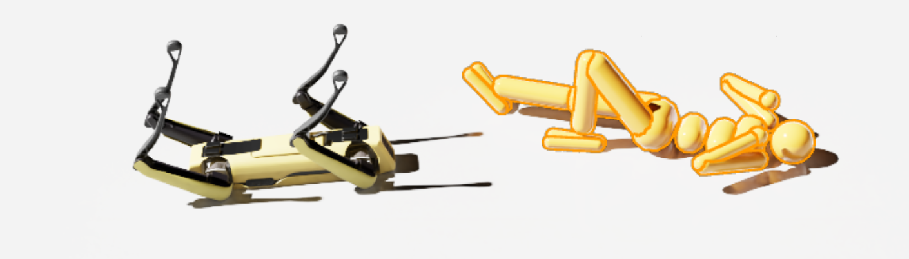
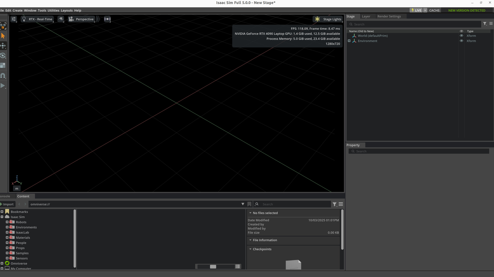

# 仿真资产

仿真资产（Simulation Assets）是机器人仿真里的“可复用世界零件”。机器人本体、末端执行器、桌子、杯子、抽屉、地形、灯光、相机、LiDAR、材质贴图、碰撞体、标注信息，统统都属于资产层。很多团队把仿真理解成“选一个仿真器然后把机器人导进去”，真正做起来才会发现，训练效果、仿真稳定性、渲染真实度、Sim2Real 表现，往往先败在资产质量上，而不是算法本身。

这篇笔记专门回答资产层的问题：**仿真里到底有哪些资产，它们如何被建模、制作、导入、管理、验证，并最终变成一个可训练、可调试、可迁移的仿真世界。** 关于平台选型见 [仿真平台](simulation_platforms.md)，关于世界组织和物理规则见 [仿真世界构建与物理规则](仿真世界构建与物理规则.md)，关于格式语法基础见 [开发工具链](开发工具链.md)。

---

## 1. 仿真资产总论

### 1.1 什么是资产层

在机器人仿真中，可以把工程栈粗略拆成四层：

<!-- SVG-DESIGN-NOTES
Type: A (结构 / 分层承载，非平行方框)
Q0: 仿真工程栈是一座倒金字塔——算法层 (RL/IL/VLA) 站在最顶端但承重最小，越往下越宽：资产层是整个栈最宽、最厚的承重基座，资产质量是第一性问题
Q1: 四个梯形从上 (窄=算法) 到下 (宽=资产+平台) 堆叠，宽度 ∝ "承重责任"；资产层用 accent 强调色填充并加粗最厚，其他层细描；右侧用一条"故障下渗"虚线箭头表明上层 bug 多数根因在资产层
Q2: 去掉标题：一个宽度递增、资产层被显著放大的倒金字塔 = "资产是地基"的命题，等大 4 方框竖排做不到这点
Q3: 删掉 4 个等大 rect + 3 条竖直箭头 (它们暗示"平等的流水线"，与本文"资产层最重"论点矛盾)
Q4: 层名贴在各自梯形内；"故障根因下渗至此"标注直接连到资产层
Q5: 全 var(--dia-*)；资产层 accent 填充，其余 stroke-soft；中英标签共用
-->
<div class="diagram">
<svg viewBox="0 0 560 400" xmlns="http://www.w3.org/2000/svg" role="img" aria-label="Simulation stack as an inverted pyramid with the asset layer as the widest load-bearing base">
  <text x="280" y="26" text-anchor="middle" font-family="Fraunces, Georgia, serif" font-style="italic" font-weight="600" font-size="16" fill="var(--dia-stroke)">仿真工程栈 — 资产层是最宽的承重基座</text>

  <!-- algorithm layer (narrowest, top) -->
  <polygon points="210,52 350,52 335,96 225,96" fill="var(--dia-bg-card)" stroke="var(--dia-stroke-soft)" stroke-width="1.4"/>
  <text x="280" y="72" text-anchor="middle" font-family="Fraunces, Georgia, serif" font-weight="600" font-size="12" fill="var(--dia-stroke)">算法层</text>
  <text x="280" y="87" text-anchor="middle" font-family="Fraunces, Georgia, serif" font-style="italic" font-size="10" fill="var(--dia-stroke-soft)">RL / IL / VLA / Planner / Eval</text>

  <!-- world layer -->
  <polygon points="180,100 380,100 360,156 200,156" fill="var(--dia-bg-card)" stroke="var(--dia-stroke-soft)" stroke-width="1.4"/>
  <text x="280" y="122" text-anchor="middle" font-family="Fraunces, Georgia, serif" font-weight="600" font-size="12" fill="var(--dia-stroke)">世界层</text>
  <text x="280" y="138" text-anchor="middle" font-family="Fraunces, Georgia, serif" font-style="italic" font-size="10" fill="var(--dia-stroke-soft)">World / Task / Reset / Randomization</text>

  <!-- ASSET layer (widest + thickest + accent — the thesis) -->
  <polygon points="120,160 440,160 415,256 145,256" fill="var(--dia-accent)" opacity="0.15"/>
  <polygon points="120,160 440,160 415,256 145,256" fill="none" stroke="var(--dia-accent)" stroke-width="2.6"/>
  <text x="280" y="192" text-anchor="middle" font-family="Fraunces, Georgia, serif" font-weight="700" font-size="15" fill="var(--dia-accent-deep)">资产层 (第一性问题)</text>
  <text x="280" y="214" text-anchor="middle" font-family="Fraunces, Georgia, serif" font-style="italic" font-size="11" fill="var(--dia-stroke)">Robot · Object · Scene · Sensor · Material</text>
  <text x="280" y="234" text-anchor="middle" font-family="Fraunces, Georgia, serif" font-style="italic" font-size="10" fill="var(--dia-stroke-soft)">几何正确 + 物理稳定 + 交互明确 + 可复用</text>

  <!-- platform layer (foundation) -->
  <polygon points="90,260 470,260 470,330 90,330" fill="var(--dia-bg-deep)" stroke="var(--dia-stroke-soft)" stroke-width="1.4"/>
  <text x="280" y="288" text-anchor="middle" font-family="Fraunces, Georgia, serif" font-weight="600" font-size="12" fill="var(--dia-stroke)">平台层</text>
  <text x="280" y="305" text-anchor="middle" font-family="Fraunces, Georgia, serif" font-style="italic" font-size="10" fill="var(--dia-stroke-soft)">Isaac Sim / MuJoCo / Gazebo / SAPIEN</text>

  <!-- fault-sink annotation -->
  <path d="M 478 78 C 510 110 510 170 470 205" fill="none" stroke="var(--dia-accent)" stroke-width="1.2" stroke-dasharray="4 3"/>
  <polygon points="470,205 478,196 480,210" fill="var(--dia-accent)"/>
  <text x="500" y="135" text-anchor="middle" font-family="Fraunces, Georgia, serif" font-style="italic" font-size="10" fill="var(--dia-accent-deep)" transform="rotate(90 500 135)">上层故障根因多数下渗至此</text>
</svg>
</div>
<p class="figure-caption">Figure 1 — 仿真栈是倒金字塔：算法层在顶端承重最小，资产层是最宽最厚的承重基座；上层故障的根因多数下渗至资产层。</p>


- **平台层**决定你能用什么物理引擎、渲染器、API 和性能上限。
- **资产层**决定机器人、物体、场景、传感器是否“像回事”、是否稳定、是否方便复用。
- **世界层**决定这些资产如何被摆放、重置、组合成任务。
- **算法层**才是在这些基础之上训练或评测策略。

资产层的职责不是“把一个 mesh 放进去”这么简单，而是把视觉、物理、交互、标定、命名、版本管理统一起来。

### 1.2 资产层与其他章节的边界

| 主题 | 本文关注点 | 相关章节 |
|------|------------|----------|
| 仿真器选型 | 不展开选型，只说明不同平台承载资产的差异 | [仿真平台](simulation_platforms.md), [仿真工具对比](仿真工具对比.md) |
| 世界层次与物理规则 | 只讲资产如何提供参数，不讲 solver 与时间步理论 | [仿真世界构建与物理规则](仿真世界构建与物理规则.md) |
| URDF/MJCF/SDF/USD 语法 | 不做基础语法教程，重点讲这些格式在资产工程中的表达能力 | [开发工具链](开发工具链.md) |
| 控制、动力学、接触理论 | 只在资产参数需要时做最小引用 | [控制理论](../03_Robotics/控制理论.md), [动力学](../03_Robotics/动力学.md) |
| Sim2Real | 只讨论资产如何支持随机化和现实对齐 | [Sim2Real](../04_Robot_Learning/Sim2Real.md) |

### 1.3 为什么资产质量是第一性问题

很多训练失败，表面像是“奖励写坏了”“策略学不动”“sim-to-real gap 太大”，实际根因却在资产层：

- 机器人 link 的惯量写错，导致控制器天生不稳。
- collision mesh 太复杂，求解器接触时间飙升。
- 传感器朝向配置反了，视觉策略永远学不到目标。
- 材质和灯光过于理想，部署时视觉直接失效。
- 物体 pivot 位置错误，抽屉门把手一抓就飞。
- 命名和元数据混乱，数据生成后无法追溯版本。

可以把资产质量看成一种隐式先验：

$$
\text{Training Outcome} \approx f(\text{Policy}, \text{World}, \text{Assets}, \text{Physics}, \text{Data})
$$

在很多工程场景中，`Assets` 是最先需要被治理的项。

### 1.4 仿真资产的生命周期

<!-- SVG-DESIGN-NOTES
Type: C (过程演化 / 闭环生命周期，非单行流水线)
Q0: 资产生命周期是一个闭环——发布的资产被世界层复用后会暴露新需求，回流到需求定义重新迭代，不是一条单向 9 步直线
Q1: 9 个阶段沿一个圆环顺时针排布，节点用小圆，环上 arc 箭头连接；闭合处 (发布→需求) 用强调色 arc 表示"复用反哺新需求"的回流；圆心写一句生命周期不变量
Q2: 去掉标题：一个带回流闭合的环 = "资产是活的、被持续迭代"的命题，9 个等大 box 横排（且严重溢出 viewBox）无法表达闭环
Q3: 删掉 9 个等大 rect + 8 条直箭头 (原图内容 x 坐标到 2020 远超 900 viewBox，渲染时大半被裁掉)
Q4: 阶段名贴在每个环节点外侧；回流语义标注贴在闭合 arc 上
Q5: 全 var(--dia-*)；回流 arc 用 accent；其余 stroke；中英标签共用
-->
<div class="diagram">
<svg viewBox="0 0 560 460" xmlns="http://www.w3.org/2000/svg" role="img" aria-label="Asset lifecycle as a closed loop where published assets feed new requirements">
  <defs>
    <marker id="lc-arr" markerWidth="9" markerHeight="9" refX="7" refY="3" orient="auto"><path d="M0,0 L0,6 L8,3 z" fill="var(--dia-stroke-soft)"/></marker>
    <marker id="lc-arr-a" markerWidth="9" markerHeight="9" refX="7" refY="3" orient="auto"><path d="M0,0 L0,6 L8,3 z" fill="var(--dia-accent)"/></marker>
  </defs>
  <text x="280" y="26" text-anchor="middle" font-family="Fraunces, Georgia, serif" font-style="italic" font-weight="600" font-size="16" fill="var(--dia-stroke)">资产生命周期 — 发布后复用反哺新需求的闭环</text>

  <!-- ring guide -->
  <circle cx="280" cy="250" r="150" fill="none" stroke="var(--dia-stroke-soft)" stroke-width="0.8" stroke-dasharray="2 4"/>

  <!-- 9 stage nodes around the ring (angles, clockwise from top) -->
  <!-- positions precomputed for r=150, center (280,250) -->
  <g font-family="Fraunces, Georgia, serif" font-size="11" fill="var(--dia-stroke)" text-anchor="middle">
    <circle cx="280" cy="100" r="6" fill="var(--dia-accent)"/><text x="280" y="86">① 需求定义</text>
    <circle cx="376" cy="135" r="5" fill="var(--dia-stroke)"/><text x="416" y="128">② 几何建模</text>
    <circle cx="430" cy="220" r="5" fill="var(--dia-stroke)"/><text x="478" y="218">③ 视觉整理</text>
    <circle cx="430" cy="313" r="5" fill="var(--dia-stroke)"/><text x="478" y="316">④ 物理补全</text>
    <circle cx="358" cy="378" r="5" fill="var(--dia-stroke)"/><text x="392" y="404">⑤ 传感器/关节绑定</text>
    <circle cx="255" cy="399" r="5" fill="var(--dia-stroke)"/><text x="240" y="424">⑥ 导入仿真器</text>
    <circle cx="160" cy="360" r="5" fill="var(--dia-stroke)"/><text x="118" y="378">⑦ 调试验证</text>
    <circle cx="135" cy="270" r="5" fill="var(--dia-stroke)"/><text x="86" y="268">⑧ 版本发布</text>
    <circle cx="170" cy="170" r="5" fill="var(--dia-stroke)"/><text x="128" y="160">⑨ 世界复用</text>
  </g>

  <!-- forward arcs between consecutive stages -->
  <g fill="none" stroke="var(--dia-stroke-soft)" stroke-width="1.4">
    <path d="M 296 109 A 150 150 0 0 1 365 128" marker-end="url(#lc-arr)"/>
    <path d="M 388 145 A 150 150 0 0 1 428 206" marker-end="url(#lc-arr)"/>
    <path d="M 430 236 A 150 150 0 0 1 430 298" marker-end="url(#lc-arr)"/>
    <path d="M 426 328 A 150 150 0 0 1 372 369" marker-end="url(#lc-arr)"/>
    <path d="M 343 386 A 150 150 0 0 1 271 399" marker-end="url(#lc-arr)"/>
    <path d="M 240 397 A 150 150 0 0 1 172 366" marker-end="url(#lc-arr)"/>
    <path d="M 150 349 A 150 150 0 0 1 134 284" marker-end="url(#lc-arr)"/>
    <path d="M 137 254 A 150 150 0 0 1 163 184" marker-end="url(#lc-arr)"/>
  </g>
  <!-- feedback arc: ⑨ world reuse → ① requirement (accent, the loop closure) -->
  <path d="M 182 158 A 150 150 0 0 1 266 103" fill="none" stroke="var(--dia-accent)" stroke-width="2" marker-end="url(#lc-arr-a)"/>
  <text x="195" y="118" font-family="Fraunces, Georgia, serif" font-style="italic" font-size="10" fill="var(--dia-accent-deep)">复用暴露新需求</text>

  <!-- center invariant -->
  <text x="280" y="244" text-anchor="middle" font-family="Fraunces, Georgia, serif" font-style="italic" font-size="11" fill="var(--dia-stroke)">不变量：每个阶段产出</text>
  <text x="280" y="260" text-anchor="middle" font-family="Fraunces, Georgia, serif" font-style="italic" font-size="11" fill="var(--dia-stroke)">都带语义 + 版本元数据</text>
</svg>
</div>
<p class="figure-caption">Figure 2 — 资产生命周期是一个闭环：发布的资产被世界层复用后会暴露新需求，回流到需求定义重新迭代，每个阶段产出都带语义+版本元数据。</p>


### 1.5 资产工程的核心目标

一个“好资产”不是看起来漂亮而已，它要同时满足：

1. **几何正确**：尺寸、坐标轴、局部原点、法线、拓扑没有明显错误。
2. **视觉可信**：材质和贴图能表达外观差异，支持后续视觉随机化。
3. **物理稳定**：质量、惯量、碰撞代理、关节限制合理，能稳定求解。
4. **交互明确**：抓取点、接触面、铰接轴、可动部件定义清楚。
5. **可复用**：命名、目录、元数据、版本管理规范。
6. **可迁移**：能在多个仿真器或数据管线中转换和复用。

---

## 2. 资产分类体系

### 2.1 资产类型总览

<!-- SVG-DESIGN-NOTES
Type: A (结构 / 分区 treemap，非超长树)
Q0: 仿真资产不是 7 个并列类目，而是按"工程治理负担"分配不同面积的版图——机器人资产与可交互物体资产占据最大块（最难做对、bug 最多），传感器/场景/材质次之，元数据虽小却横跨所有类
Q1: 一个 treemap：每个一级资产类是一个矩形，面积 ∝ 工程治理负担；内部再切出二级子项小格；元数据资产做成一条横跨底部的薄带表达"横切关注点"
Q2: 去掉标题：大小不等的嵌套矩形分区 + 一条横切薄带 = "资产治理负担分布不均、元数据横切"的命题，560×1980 的等宽方框树（渲染时纵向被严重裁切）做不到
Q3: 删掉 ~30 个等大 rect + ~33 条直箭头组成的 1980px 高竖树（绝大部分超出可视区）
Q4: 类名贴在每个分区左上；子项名贴在各自小格内
Q5: 全 var(--dia-*)；机器人/物体用 accent 强调（治理负担最重），其余 stroke；元数据带用 gold；中英共用
-->
<div class="diagram">
<svg viewBox="0 0 720 480" xmlns="http://www.w3.org/2000/svg" role="img" aria-label="Simulation asset taxonomy as a treemap where area encodes engineering governance burden">
  <text x="360" y="26" text-anchor="middle" font-family="Fraunces, Georgia, serif" font-style="italic" font-weight="600" font-size="16" fill="var(--dia-stroke)">资产分类 — 分区面积 ∝ 工程治理负担</text>

  <!-- Robot assets: largest block (heaviest burden) -->
  <rect x="40" y="48" width="330" height="220" fill="var(--dia-accent)" opacity="0.12"/>
  <rect x="40" y="48" width="330" height="220" fill="none" stroke="var(--dia-accent)" stroke-width="2"/>
  <text x="50" y="68" font-family="Fraunces, Georgia, serif" font-weight="700" font-size="13" fill="var(--dia-accent-deep)">机器人资产</text>
  <g font-family="Fraunces, Georgia, serif" font-size="10" fill="var(--dia-stroke)">
    <rect x="50" y="78" width="100" height="84" fill="none" stroke="var(--dia-stroke-soft)" stroke-width="1"/><text x="58" y="94">结构 link/joint</text><text x="58" y="108" font-size="9" fill="var(--dia-stroke-soft)">collision · inertial</text>
    <rect x="156" y="78" width="100" height="84" fill="none" stroke="var(--dia-stroke-soft)" stroke-width="1"/><text x="164" y="94">驱动/传动</text><text x="164" y="108" font-size="9" fill="var(--dia-stroke-soft)">motor · stiffness</text>
    <rect x="262" y="78" width="98" height="84" fill="none" stroke="var(--dia-stroke-soft)" stroke-width="1"/><text x="270" y="94">末端执行器</text><text x="270" y="108" font-size="9" fill="var(--dia-stroke-soft)">gripper · hand</text>
    <rect x="50" y="168" width="155" height="92" fill="none" stroke="var(--dia-stroke-soft)" stroke-width="1"/><text x="58" y="184">本体传感器</text><text x="58" y="198" font-size="9" fill="var(--dia-stroke-soft)">IMU · joint encoder</text>
    <rect x="211" y="168" width="149" height="92" fill="none" stroke="var(--dia-stroke-soft)" stroke-width="1"/><text x="219" y="184">控制接口/调试元数据</text><text x="219" y="198" font-size="9" fill="var(--dia-stroke-soft)">命令空间 · 命名规范</text>
  </g>

  <!-- Interactive object assets: second largest -->
  <rect x="376" y="48" width="304" height="146" fill="var(--dia-accent)" opacity="0.10"/>
  <rect x="376" y="48" width="304" height="146" fill="none" stroke="var(--dia-accent)" stroke-width="1.8"/>
  <text x="386" y="68" font-family="Fraunces, Georgia, serif" font-weight="700" font-size="13" fill="var(--dia-accent-deep)">可交互物体资产</text>
  <g font-family="Fraunces, Georgia, serif" font-size="10" fill="var(--dia-stroke)">
    <rect x="386" y="78" width="92" height="108" fill="none" stroke="var(--dia-stroke-soft)" stroke-width="1"/><text x="394" y="94">刚体</text><text x="394" y="108" font-size="9" fill="var(--dia-stroke-soft)">工具/容器</text>
    <rect x="484" y="78" width="92" height="108" fill="none" stroke="var(--dia-stroke-soft)" stroke-width="1"/><text x="492" y="94">铰接体</text><text x="492" y="108" font-size="9" fill="var(--dia-stroke-soft)">抽屉/门</text>
    <rect x="582" y="78" width="90" height="108" fill="none" stroke="var(--dia-stroke-soft)" stroke-width="1"/><text x="590" y="94">柔性体</text><text x="590" y="108" font-size="9" fill="var(--dia-stroke-soft)">布/线缆</text>
  </g>

  <!-- Sensor assets -->
  <rect x="376" y="200" width="148" height="120" fill="var(--dia-bg-card)" stroke="var(--dia-stroke)" stroke-width="1.4"/>
  <text x="386" y="220" font-family="Fraunces, Georgia, serif" font-weight="600" font-size="12" fill="var(--dia-stroke)">传感器资产</text>
  <text x="386" y="240" font-family="Fraunces, Georgia, serif" font-size="10" fill="var(--dia-stroke-soft)">Camera · LiDAR</text>
  <text x="386" y="256" font-family="Fraunces, Georgia, serif" font-size="10" fill="var(--dia-stroke-soft)">IMU · Force/Contact</text>
  <text x="386" y="276" font-family="Fraunces, Georgia, serif" font-size="10" fill="var(--dia-stroke-soft)">安装位姿 + 噪声/标定接口</text>

  <!-- Scene + terrain assets -->
  <rect x="530" y="200" width="150" height="120" fill="var(--dia-bg-card)" stroke="var(--dia-stroke)" stroke-width="1.4"/>
  <text x="540" y="220" font-family="Fraunces, Georgia, serif" font-weight="600" font-size="12" fill="var(--dia-stroke)">场景/地形资产</text>
  <text x="540" y="240" font-family="Fraunces, Georgia, serif" font-size="10" fill="var(--dia-stroke-soft)">房间 · 桌面 · 工位</text>
  <text x="540" y="256" font-family="Fraunces, Georgia, serif" font-size="10" fill="var(--dia-stroke-soft)">坡道/楼梯/软地</text>
  <text x="540" y="276" font-family="Fraunces, Georgia, serif" font-size="10" fill="var(--dia-stroke-soft)">背景与障碍物</text>

  <!-- Render assets -->
  <rect x="40" y="276" width="330" height="64" fill="var(--dia-bg-card)" stroke="var(--dia-stroke)" stroke-width="1.4"/>
  <text x="50" y="296" font-family="Fraunces, Georgia, serif" font-weight="600" font-size="12" fill="var(--dia-stroke)">渲染资产</text>
  <text x="50" y="316" font-family="Fraunces, Georgia, serif" font-size="10" fill="var(--dia-stroke-soft)">材质 · 纹理 · 灯光 · 天空盒 · 地板</text>
  <text x="50" y="332" font-family="Fraunces, Georgia, serif" font-size="9" fill="var(--dia-stroke-soft)">视觉随机化友好设计</text>

  <!-- Metadata: cross-cutting strip spanning the bottom -->
  <rect x="40" y="356" width="640" height="56" fill="var(--dia-gold)" opacity="0.16"/>
  <rect x="40" y="356" width="640" height="56" fill="none" stroke="var(--dia-gold)" stroke-width="1.8" stroke-dasharray="5 3"/>
  <text x="50" y="378" font-family="Fraunces, Georgia, serif" font-weight="600" font-size="12" fill="var(--dia-gold)">元数据资产（横切所有类）</text>
  <text x="50" y="398" font-family="Fraunces, Georgia, serif" font-size="10" fill="var(--dia-stroke-soft)">标注 · 语义标签 · 版本号 · 数据接口 — 每一类资产都必须携带，否则数据生成后无法追溯</text>

  <text x="360" y="438" text-anchor="middle" font-family="Fraunces, Georgia, serif" font-style="italic" font-size="10" fill="var(--dia-stroke-soft)">面积越大 = 越难做对、调试代价越高 · 元数据是贯穿全栈的薄而关键的横切带</text>
</svg>
</div>
<p class="figure-caption">Figure 3 — 资产分类是面积不均的版图：机器人/可交互物体治理负担最重（占面积最大），元数据是横切所有类的薄而关键的带。</p>


### 2.2 从训练任务角度看资产

| 任务类型 | 核心资产 | 常见额外资产 | 资产难点 |
|----------|----------|--------------|----------|
| 桌面抓取 | 机械臂、夹爪、桌子、杯子、盒子 | 俯视相机、腕部相机、背景板 | 物体尺寸与抓取点 |
| 铰接操作 | 柜门、抽屉、水龙头、旋钮 | 接触传感器、限位约束 | 轴心和阻尼配置 |
| 插拔装配 | 插头、孔槽、定位治具 | 高精度碰撞代理、力觉 | 公差和接触稳定性 |
| 移动导航 | 地图、障碍物、门、走廊 | LiDAR、IMU、语义标签 | 大场景分块和重置 |
| 四足地形 | 地面、坡道、楼梯、软地 | 高度图、接触点 | 地形材质与摩擦 |
| 人形搬运 | 全身机器人、箱体、工位 | 多相机、接触/力矩传感器 | 自碰撞与大质量物体 |

### 2.3 从工程职责角度看资产

不同团队往往把资产责任分给不同角色：

| 角色 | 负责资产内容 | 典型输出 |
|------|--------------|----------|
| 机械/结构工程师 | CAD 模型、关节结构、装配逻辑 | STEP, SolidWorks, OnShape |
| 3D 美术/数字孪生工程师 | 视觉 mesh、材质、灯光、场景美术 | FBX, USD, PBR 贴图 |
| 仿真工程师 | 碰撞体、惯量、关节驱动、传感器 | URDF, MJCF, USD Physics, SDF |
| 算法工程师 | 随机化参数、采样接口、标注协议 | config, dataset schema |
| 基础设施工程师 | 资产目录、版本、缓存、CI 校验 | registry, manifest, validation script |

### 2.4 资产不是文件，而是“文件 + 语义 + 规则”

同一个杯子，在工程上至少有四层表达：

1. `cup_visual.obj`：视觉网格
2. `cup_collision.obj`：碰撞代理
3. `cup.usd` / `cup.xml`：物理与层级定义
4. `metadata.json`：类别、抓取面、可倒液体、材质标签、语义 ID

因此资产本质上是：

$$
\text{Asset} = \text{Geometry} + \text{Appearance} + \text{Physics} + \text{Semantics} + \text{Versioning}
$$

---

## 3. 几何与网格基础

### 3.1 Primitive、Mesh 与实例化

| 表达方式 | 优点 | 缺点 | 适用场景 |
|----------|------|------|----------|
| Primitive（box/sphere/capsule） | 便宜、稳定、易算惯量 | 外形粗糙 | 碰撞体、原型验证 |
| Triangular Mesh | 外观自由度高 | 计算量大、拓扑问题多 | 视觉资产 |
| Convex Hull | 碰撞稳定、计算较快 | 形状逼近有限 | 碰撞代理 |
| Decomposed Convex Mesh | 平衡精度与稳定性 | 需要分解流程 | 可交互物体碰撞 |
| Instancing | 节省显存和加载时间 | 定制能力受限 | 仓储箱体、桌椅批量场景 |

### 3.2 坐标轴、单位与缩放

资产工程里最常见的错误不是高深数学，而是单位和坐标轴不统一。

| 维度 | 常见约定 | 典型坑 |
|------|----------|--------|
| 长度单位 | 米（m） | CAD 导出成毫米，导入后物体缩小 1000 倍 |
| up 轴 | `+Z` 或 `+Y` | Maya/Blender/Unity/ROS 约定不同 |
| 角度单位 | 弧度 | 关节限制配置时混入度数 |
| 尺寸缩放 | 统一在导出前 bake | 导入时临时 scale，导致惯量和碰撞代理不一致 |

资产导出前最好建立固定规范：

- 几何原始单位统一为米。
- 根节点缩放为 `1,1,1`。
- 局部坐标系尽量与实际装配坐标一致。
- 关节轴方向在 CAD、描述文件、仿真器中保持同向。

### 3.3 局部原点与 pivot

局部原点（pivot）不是可有可无的美术细节，它直接影响：

- 抓取点定义
- 铰接轴旋转中心
- 物体摆放和重置
- 语义操作点

例如抽屉资产：

- 视觉 mesh 的 pivot 若在几何中心，渲染可能没问题。
- 但世界层希望抽屉沿滑轨移动，局部原点更适合放在滑轨参考位置。
- 若 pivot 混乱，`OpenDrawer` 任务的位姿采样和轨迹规划都会变得别扭。

### 3.4 网格拓扑与法线

不良网格的典型症状：

- 法线反转，表面发黑或闪烁
- 非流形边，凸分解失败
- 重叠面，接触计算发散
- 三角面过密，FPS 下降
- 细长三角形过多，碰撞代理生成异常

### 3.5 LOD（Level of Detail）

大场景里，LOD 是资产工程必须考虑的项。

| LOD 层级 | 面数级别 | 用途 |
|----------|----------|------|
| LOD0 | 最高 | 近景渲染、截图、演示 |
| LOD1 | 中等 | 普通训练/交互 |
| LOD2 | 低 | 远景或背景物体 |
| Collision Proxy | 极低 | 碰撞与接触 |

建议做法：

- 视觉 mesh 和碰撞 mesh 分离。
- 远景背景家具使用低模或实例化。
- 训练环境优先保证接触稳定，再追求画面质量。

### 3.6 UV 与贴图基础

一个有用资产至少要明确：

- 是否有合理 UV 展开
- 贴图是否支持平铺
- 法线贴图与粗糙度贴图是否匹配
- 纹理分辨率是否过高

<!-- SVG-DESIGN-NOTES
Type: A+B (几何 / UV 展开映射，非流水线方框)
Q0: UV 展开的本质是把 3D mesh 表面"剪开摊平"到 2D [0,1]² 纹理空间——每个 3D 三角面对应 2D UV 一块，贴图采样靠这张映射；展开质量 (接缝、拉伸) 直接决定材质能否对齐
Q1: 左侧画一个 3D cube mesh (带可见三角剖分)，右侧画一张 [0,1]² UV 方格 + cube 展开成的"十字/T 形" UV island；用 2-3 条对应连线把同一三角面的 3D 顶点与其 2D UV 坐标连起来；底部一条窄带顺序标注 retopo→UV→bake→PBR→import 五步作为工序锚点
Q2: 去掉标题：一个带三角剖分的立方体 + 一张 [0,1]² 上的十字展开图 + 顶点对应连线 = "UV 是 3D 面到 2D 纹理坐标的映射"，6 个等大流水线 box（且 x 到 1560 远超 900 viewBox 被裁切）完全无法表达
Q3: 删掉 6 个等大 rect + 6 条直箭头 (溢出 viewBox 大半被裁)；改为真 3D 网格 + 真 UV 方格 + 对应连线
Q4: u/v 轴刻度贴 UV 方格;同名顶点 A/B/C 同时标在 3D 与 2D 两侧;五步工序贴底部锚带
Q5: 全 var(--dia-*)；3D 用 stroke，UV island 用 accent 填充，对应连线用 blue 虚线；中英共用
-->
<div class="diagram">
<svg viewBox="0 0 760 360" xmlns="http://www.w3.org/2000/svg" role="img" aria-label="UV unwrap maps a 3D mesh surface onto the 2D [0,1] texture square">
  <text x="380" y="26" text-anchor="middle" font-family="Fraunces, Georgia, serif" font-style="italic" font-weight="600" font-size="16" fill="var(--dia-stroke)">UV 展开 — 把 3D 表面剪开摊平到 [0,1]² 纹理空间</text>

  <!-- LEFT: 3D cube mesh with visible triangulation -->
  <text x="170" y="58" text-anchor="middle" font-family="Fraunces, Georgia, serif" font-style="italic" font-size="12" fill="var(--dia-stroke-soft)">3D mesh（带三角剖分）</text>
  <!-- cube faces (isometric-ish) -->
  <polygon points="110,110 230,110 270,150 150,150" fill="var(--dia-bg-card)" stroke="var(--dia-stroke)" stroke-width="1.4"/>
  <polygon points="110,110 150,150 150,270 110,230" fill="var(--dia-bg-deep)" stroke="var(--dia-stroke)" stroke-width="1.4"/>
  <polygon points="150,150 270,150 270,270 150,270" fill="var(--dia-bg-card)" stroke="var(--dia-stroke)" stroke-width="1.4"/>
  <!-- triangulation on front face -->
  <line x1="150" y1="150" x2="270" y2="270" stroke="var(--dia-stroke-soft)" stroke-width="0.9"/>
  <line x1="110" y1="110" x2="270" y2="150" stroke="var(--dia-stroke-soft)" stroke-width="0.9"/>
  <line x1="110" y1="110" x2="150" y2="270" stroke="var(--dia-stroke-soft)" stroke-width="0.9"/>
  <!-- labelled verts on front face -->
  <circle cx="150" cy="150" r="3.5" fill="var(--dia-accent)"/><text x="138" y="146" font-family="JetBrains Mono, monospace" font-size="10" fill="var(--dia-accent-deep)">A</text>
  <circle cx="270" cy="150" r="3.5" fill="var(--dia-accent)"/><text x="276" y="146" font-family="JetBrains Mono, monospace" font-size="10" fill="var(--dia-accent-deep)">B</text>
  <circle cx="270" cy="270" r="3.5" fill="var(--dia-accent)"/><text x="276" y="283" font-family="JetBrains Mono, monospace" font-size="10" fill="var(--dia-accent-deep)">C</text>

  <!-- RIGHT: 2D UV [0,1]^2 square with cross-shaped island -->
  <text x="560" y="58" text-anchor="middle" font-family="Fraunces, Georgia, serif" font-style="italic" font-size="12" fill="var(--dia-stroke-soft)">2D UV [0,1]² 纹理空间</text>
  <rect x="450" y="70" width="220" height="220" fill="none" stroke="var(--dia-stroke)" stroke-width="1.3"/>
  <text x="445" y="296" text-anchor="end" font-family="JetBrains Mono, monospace" font-size="10" fill="var(--dia-stroke-soft)">0</text>
  <text x="445" y="76" text-anchor="end" font-family="JetBrains Mono, monospace" font-size="10" fill="var(--dia-stroke-soft)">1</text>
  <text x="670" y="306" text-anchor="middle" font-family="JetBrains Mono, monospace" font-size="10" fill="var(--dia-stroke-soft)">1</text>
  <text x="560" y="320" text-anchor="middle" font-family="Fraunces, Georgia, serif" font-style="italic" font-size="10" fill="var(--dia-stroke-soft)">u →</text>
  <text x="438" y="180" text-anchor="middle" font-family="Fraunces, Georgia, serif" font-style="italic" font-size="10" fill="var(--dia-stroke-soft)" transform="rotate(-90 438 180)">v →</text>
  <!-- cube unwrapped as a cross/T island -->
  <g fill="var(--dia-accent)" opacity="0.13" stroke="var(--dia-accent)" stroke-width="1.4">
    <rect x="510" y="100" width="50" height="50"/>
    <rect x="510" y="150" width="50" height="50"/>
    <rect x="460" y="150" width="50" height="50"/>
    <rect x="560" y="150" width="50" height="50"/>
    <rect x="510" y="200" width="50" height="50"/>
    <rect x="510" y="250" width="50" height="40"/>
  </g>
  <!-- triangulation + verts inside front-face UV cell -->
  <line x1="510" y1="150" x2="560" y2="200" stroke="var(--dia-stroke-soft)" stroke-width="0.9"/>
  <circle cx="510" cy="150" r="3.5" fill="var(--dia-accent)"/><text x="498" y="146" font-family="JetBrains Mono, monospace" font-size="10" fill="var(--dia-accent-deep)">A</text>
  <circle cx="560" cy="150" r="3.5" fill="var(--dia-accent)"/><text x="566" y="146" font-family="JetBrains Mono, monospace" font-size="10" fill="var(--dia-accent-deep)">B</text>
  <circle cx="560" cy="200" r="3.5" fill="var(--dia-accent)"/><text x="566" y="214" font-family="JetBrains Mono, monospace" font-size="10" fill="var(--dia-accent-deep)">C</text>

  <!-- correspondence lines (same triangle: 3D vert ↔ UV coord) -->
  <g stroke="var(--dia-blue)" stroke-width="1" stroke-dasharray="3 3" fill="none">
    <path d="M 153 150 C 320 130 360 145 507 150"/>
    <path d="M 273 150 C 380 150 460 150 557 150"/>
    <path d="M 273 270 C 390 250 470 215 557 200"/>
  </g>
  <text x="380" y="120" text-anchor="middle" font-family="Fraunces, Georgia, serif" font-style="italic" font-size="10" fill="var(--dia-blue)">同一三角面：3D 顶点 ↔ UV 坐标</text>

  <!-- bottom process anchor strip -->
  <line x1="60" y1="332" x2="700" y2="332" stroke="var(--dia-stroke-soft)" stroke-width="0.8"/>
  <text x="380" y="350" text-anchor="middle" font-family="JetBrains Mono, monospace" font-size="10" fill="var(--dia-stroke-soft)">retopo → UV unwrap → bake maps → PBR textures → sim import</text>
</svg>
</div>
<p class="figure-caption">Figure 4 — UV 展开把 3D mesh 表面剪开摊平到 [0,1]² 纹理空间；同一三角面的 3D 顶点与 2D UV 坐标一一对应，接缝/拉伸质量决定材质能否对齐。</p>


### 3.7 几何资产的最小检查表

| 检查项 | 合格标准 |
|--------|----------|
| 单位 | 米 |
| 轴向 | 文档化且统一 |
| 缩放 | 根节点缩放为 1 |
| 法线 | 朝向正确 |
| 拓扑 | 无明显非流形错误 |
| LOD | 至少有训练级与展示级区分 |
| collision proxy | 已准备 |

---

## 4. 视觉资产制作

### 4.1 视觉资产的目标不是“越真实越好”

视觉资产通常在三个目标之间取平衡：

1. **写实性**：尽量接近真实照片或真实场景。
2. **可控性**：便于随机化颜色、纹理、反射、光照。
3. **性能**：训练环境能跑得动。

对仿真训练而言，“可控且稳定的逼真”通常比“极限画质”更重要。

### 4.2 PBR 材质体系

PBR（Physically Based Rendering）通常包含：

| 贴图/参数 | 作用 | 常见问题 |
|-----------|------|----------|
| Base Color / Albedo | 表面颜色 | 把阴影烘进颜色图，导致随机化困难 |
| Normal Map | 细节法线 | 法线空间不匹配 |
| Roughness | 粗糙度 | 金属/塑料区分不明显 |
| Metallic | 金属度 | 误把所有灰色表面都当金属 |
| AO | 环境遮蔽 | 与实时阴影重复叠加 |
| Emissive | 自发光 | 不必要地引入亮斑 |

### 4.3 颜色空间

视觉资产管线里经常混淆两种空间：

- **sRGB**：给人看的颜色空间
- **Linear**：给渲染计算用的线性空间

典型规则：

- base color 通常用 sRGB
- roughness / metallic / normal 通常用 linear

如果这一步错了，会导致：

- 材质对比异常
- 金属表面过亮
- 训练图像和真实相机分布差异扩大

### 4.4 材质风格库

在机器人仿真里，建议构建可复用的材质风格库，而不是每次手工调。

| 材质类别 | 关键参数 | 典型对象 |
|----------|----------|----------|
| 哑光塑料 | 低金属度、中高粗糙度 | 杯子、盒子、工具壳 |
| 抛光金属 | 高金属度、低粗糙度 | 不锈钢容器、夹具 |
| 喷涂金属 | 中等粗糙度 | 工业柜体、机械外壳 |
| 木质桌面 | 非金属、法线纹理弱 | 餐桌、工作台 |
| 织物 | 高粗糙度、法线细节 | 沙发、布袋 |
| 透明材料 | 折射/反射依赖渲染器 | 玻璃杯、透明挡板 |

### 4.5 视觉随机化友好的材质设计

如果计划做 [Sim2Real](../04_Robot_Learning/Sim2Real.md)，视觉资产最好天然支持：

- 颜色替换
- 纹理切换
- 粗糙度扰动
- 灯光方向变化
- 相机曝光变化

不推荐：

- 把颜色、阴影、污渍全部烘死在一个贴图中
- 复杂 shader 依赖专用渲染器
- 使用超高分辨率贴图覆盖整个训练场景

### 4.6 灯光也是视觉资产

灯光在世界层参与渲染规则，但从制作和复用角度，它本质上也是资产。

| 灯光类型 | 适用用途 | 常见坑 |
|----------|----------|--------|
| Directional | 室外太阳光、主方向光 | 阴影过硬，方向过于固定 |
| Point | 小范围补光 | 数量多时性能差 |
| Spot | 顶灯、工业射灯 | cone angle 设错容易过曝 |
| Dome / HDRI | 全局环境光 | 环境贴图过于理想化 |
| Rect Light | 室内软光源 | 平台支持差异较大 |

### 4.7 视觉资产检查清单

| 项目 | 目标 |
|------|------|
| 材质命名 | 统一可检索 |
| 贴图目录 | 相对路径清晰 |
| 颜色空间 | 已区分 sRGB / linear |
| 反射与粗糙度 | 合理匹配对象类别 |
| 灯光模板 | 支持复用与随机化 |
| 纹理尺寸 | 与训练分辨率匹配 |
| domain randomization | 可插拔，不依赖手工改图 |

---

## 5. 物理资产制作

### 5.1 visual mesh 与 collision mesh 必须分离

这是资产工程里最重要的规则之一。

| 项目 | visual mesh | collision mesh |
|------|-------------|----------------|
| 目标 | 好看 | 稳定、便宜 |
| 面数 | 高 | 低 |
| 细节 | 保留外观细节 | 保留接触关键轮廓 |
| 渲染 | 需要 | 不需要 |
| 碰撞计算 | 不建议直接参与 | 必须参与 |

直接拿高精度视觉 mesh 做碰撞，常见后果：

- 碰撞检测很慢
- 接触面抖动
- solver 难收敛
- 小缝隙被错误识别为可插入区域

### 5.2 Convex decomposition

对非凸物体，常见做法是把碰撞代理拆成多个凸体：

<!-- SVG-DESIGN-NOTES
Type: B+C (几何 / 凸分解，非流水线方框)
Q0: 直接拿凹形视觉网格当 collision，它的凸包会把孔洞/凹槽填满 (杯把手处变实心)，物理就错；凸分解把一个凹形拆成若干凸块的并集，既保留孔洞又让每块都能被 GJK 快速求解
Q1: 三联 small multiples 同一个"带把手的杯子"凹形轮廓：①原始凹 mesh ②它的单一凸包(灰色阴影盖住把手孔洞，标"接触错误")③凸分解成 4 个彩色凸块(杯体+3 段把手)恰好贴合凹形并保留孔洞
Q2: 去掉标题：同一凹形的"原形 / 凸包糊住孔洞 / 多凸块拼回"三联对比 = 凸分解的命题；5 个等大流水线 box 完全不传达"凹/凸/孔洞"这个几何核心
Q3: 删掉 5 个等大 rect + 4 直箭头；改为真凹形 polygon + 凸包 polygon + 多个凸块 polygon
Q4: "凸包糊住孔洞→接触错误" / "4 凸块并集保留孔洞" 直接标在对应面板
Q5: 全 var(--dia-*)；原形 stroke，错误凸包 stroke-soft 填充，凸块用 accent/green/blue/gold 区分；中英共用
-->
<div class="diagram">
<svg viewBox="0 0 760 320" xmlns="http://www.w3.org/2000/svg" role="img" aria-label="Convex decomposition of a concave mug into convex hulls preserving the handle hole">
  <defs>
    <marker id="cd-arr" markerWidth="9" markerHeight="9" refX="7" refY="3" orient="auto"><path d="M0,0 L0,6 L8,3 z" fill="var(--dia-stroke-soft)"/></marker>
  </defs>
  <text x="380" y="26" text-anchor="middle" font-family="Fraunces, Georgia, serif" font-style="italic" font-weight="600" font-size="16" fill="var(--dia-stroke)">凸分解 — 把凹形拆成凸块的并集，保留把手孔洞</text>

  <!-- shared concave "mug with handle" outline path (used as reference shape) -->
  <!-- Panel 1: original concave mesh -->
  <text x="130" y="62" text-anchor="middle" font-family="Fraunces, Georgia, serif" font-style="italic" font-size="12" fill="var(--dia-stroke-soft)">① 原始凹形视觉网格</text>
  <path d="M 70 90 L 150 90 L 150 240 L 70 240 Z" fill="var(--dia-bg-card)" stroke="var(--dia-stroke)" stroke-width="1.6"/>
  <path d="M 150 120 C 215 120 215 210 150 210 L 150 190 C 188 190 188 140 150 140 Z" fill="var(--dia-bg-card)" stroke="var(--dia-stroke)" stroke-width="1.6"/>
  <text x="178" y="170" font-family="Fraunces, Georgia, serif" font-style="italic" font-size="10" fill="var(--dia-stroke-soft)">孔洞</text>

  <path d="M 245 165 L 280 165" stroke="var(--dia-stroke-soft)" stroke-width="1.4" marker-end="url(#cd-arr)"/>

  <!-- Panel 2: single convex hull (fills the handle hole — WRONG) -->
  <text x="370" y="62" text-anchor="middle" font-family="Fraunces, Georgia, serif" font-style="italic" font-size="12" fill="var(--dia-stroke-soft)">② 单一凸包（糊住孔洞）</text>
  <polygon points="305,90 385,90 440,150 440,180 385,240 305,240" fill="var(--dia-stroke-soft)" opacity="0.28" stroke="var(--dia-stroke-soft)" stroke-width="1.6"/>
  <path d="M 305 90 L 385 90 L 385 240 L 305 240 Z" fill="none" stroke="var(--dia-stroke)" stroke-width="1.2" stroke-dasharray="3 2"/>
  <text x="390" y="265" text-anchor="middle" font-family="Fraunces, Georgia, serif" font-style="italic" font-size="10" fill="var(--dia-accent-deep)">孔洞被填实 → 接触错误</text>

  <path d="M 460 165 L 495 165" stroke="var(--dia-stroke-soft)" stroke-width="1.4" marker-end="url(#cd-arr)"/>

  <!-- Panel 3: convex decomposition into 4 convex pieces (preserves hole) -->
  <text x="615" y="62" text-anchor="middle" font-family="Fraunces, Georgia, serif" font-style="italic" font-size="12" fill="var(--dia-stroke-soft)">③ 4 个凸块并集（保留孔洞）</text>
  <rect x="520" y="90" width="70" height="150" fill="var(--dia-accent)" opacity="0.18" stroke="var(--dia-accent)" stroke-width="1.4"/>
  <polygon points="590,120 625,125 632,150 600,145" fill="var(--dia-green)" opacity="0.22" stroke="var(--dia-green)" stroke-width="1.4"/>
  <polygon points="625,125 660,150 660,180 632,150" fill="var(--dia-blue)" opacity="0.22" stroke="var(--dia-blue)" stroke-width="1.4"/>
  <polygon points="600,185 632,180 660,180 625,205 590,210" fill="var(--dia-gold)" opacity="0.24" stroke="var(--dia-gold)" stroke-width="1.4"/>
  <text x="615" y="172" text-anchor="middle" font-family="Fraunces, Georgia, serif" font-style="italic" font-size="9" fill="var(--dia-stroke-soft)">孔保留</text>
  <text x="615" y="265" text-anchor="middle" font-family="Fraunces, Georgia, serif" font-style="italic" font-size="10" fill="var(--dia-green)">每块都凸 → GJK 快且正确</text>

  <!-- bottom process anchor -->
  <line x1="60" y1="292" x2="700" y2="292" stroke="var(--dia-stroke-soft)" stroke-width="0.8"/>
  <text x="380" y="310" text-anchor="middle" font-family="JetBrains Mono, monospace" font-size="10" fill="var(--dia-stroke-soft)">原始视觉网格 → 几何清理 → 凸分解 (V-HACD) → N 个 convex hull → 物理验证</text>
</svg>
</div>
<p class="figure-caption">Figure 5 — 凸分解：直接拿凹形当 collision 会被凸包糊住孔洞导致接触错误；拆成多个凸块的并集既保留孔洞又让每块都能被 GJK 快速求解。</p>


典型适用对象：

- 杯子把手
- 抽屉柜体
- 钳子
- 门把手
- 插线板等有孔洞的物体

### 5.3 质量、质心与惯量

物理资产制作不能只写一个 `mass=1.0` 就结束。对刚体而言，至少有三个关键量：

- 质量 $m$
- 质心位置 $\mathbf{c}$
- 惯量张量 $\mathbf{I}$

对离散质量点近似，有：

$$
\mathbf{c} = \frac{1}{M}\sum_i m_i \mathbf{r}_i
$$

$$
\mathbf{I} = \sum_i m_i \left[(\mathbf{r}_i^\top \mathbf{r}_i)\mathbf{I}_3 - \mathbf{r}_i \mathbf{r}_i^\top\right]
$$

如果惯量过小，物体会像纸片一样乱飞；如果惯量过大，控制器又会显得迟钝。对机器人 link 尤其如此。

### 5.4 常见惯量错误

| 错误 | 现象 |
|------|------|
| 惯量矩阵不是正定 | 仿真器直接报错或行为异常 |
| 质心位置和实际几何错位 | 抓取或跌落姿态不合理 |
| 所有关节 link 都用同一组惯量 | 全身运动表现失真 |
| 导出时忘记 scale | 质量和体积不匹配 |

### 5.5 摩擦、恢复系数与接触参数

资产层通常至少要提供以下物理属性：

| 参数 | 含义 | 影响 |
|------|------|------|
| Static Friction | 静摩擦 | 是否容易起步滑动 |
| Dynamic Friction | 动摩擦 | 滑动过程阻力 |
| Restitution | 恢复系数 | 是否弹跳 |
| Contact Offset | 接触缓冲距离 | 提前触发接触 |
| Rest Offset | 稳态接触距离 | 接触稳定性 |

这些参数不应孤立看，而要与平台求解器、时间步和几何尺度一起调。更系统的规则见 [仿真世界构建与物理规则](仿真世界构建与物理规则.md)。

### 5.6 碰撞层与过滤

碰撞层（collision layers / masks）在大型系统里非常重要。

用途包括：

- 忽略机器人内部自碰撞中不必要的 pair
- 避免视觉装饰物参与物理
- 让抓手指尖只与目标物或环境特定层交互
- 分离触发体与实体碰撞体

### 5.7 接触 proxy 与 affordance proxy

除了真实碰撞体，很多工程系统还会额外维护两类代理：

1. **Contact Proxy**：为求解器服务的接触简化模型
2. **Affordance Proxy**：为抓取、插入、按钮按压等高层交互服务的语义代理

例如杯子可以有：

- 外壁碰撞体
- 内腔碰撞体
- 抓取区域 proxy
- 液体容积 proxy

### 5.8 物理资产的验收方式

最常见的物理资产 smoke test：

1. 自由落体是否稳定
2. 斜面滚动是否合理
3. 夹爪抓取后是否抖动/穿透
4. 多次 reset 后姿态是否一致
5. 批量并行环境中是否出现单个 outlier 爆炸

---

## 6. 机器人资产

### 6.1 机器人资产的组成

<!-- SVG-DESIGN-NOTES
Type: A (结构 / 运动学树 + 单 link 资产爆炸图，非抽象分类树)
Q0: 机器人资产不是抽象的 5 类目录，而是一棵真实的运动学链——base 经 joint 串起若干 link 直到末端执行器；每个 link 节点本身又"挂载"visual / collision / inertial / motor / sensor 五类资产，调试元数据贯穿全树
Q1: 上半画一条真实运动学链 (base → link1 → link2 → ee)，节点用方块、joint 用带转轴符号的小圆；选中 link2 用引出线"爆炸"展开它挂载的 visual/collision/inertial/motor/encoder 五个资产小卡；底部一条横带表示元数据横切
Q2: 去掉标题：一条 base→link→link→ee 的链 + 一个 link 被炸开露出 5 类挂载资产 = "机器人资产 = 运动学树 + 每 link 的资产束"，抽象 3 列分类树做不到这点
Q3: 删掉 ~15 个等大 rect + ~17 直箭头 (560×1000 抽象树，渲染时下半被裁)；改为真链 + 真 joint 符号 + 爆炸引线
Q4: link/joint 名贴在各自几何上；爆炸出的 5 类资产贴在引出卡片内
Q5: 全 var(--dia-*)；运动学链 stroke，被选 link 用 accent，挂载资产卡 blue 描边；中英共用
-->
<div class="diagram">
<svg viewBox="0 0 760 380" xmlns="http://www.w3.org/2000/svg" role="img" aria-label="Robot asset as a kinematic chain with one link exploded into its attached assets">
  <text x="380" y="26" text-anchor="middle" font-family="Fraunces, Georgia, serif" font-style="italic" font-weight="600" font-size="16" fill="var(--dia-stroke)">机器人资产 = 运动学链 + 每个 link 挂载的资产束</text>

  <!-- kinematic chain -->
  <rect x="50" y="70" width="70" height="44" rx="3" fill="var(--dia-bg-deep)" stroke="var(--dia-stroke)" stroke-width="1.6"/>
  <text x="85" y="96" text-anchor="middle" font-family="JetBrains Mono, monospace" font-size="11" fill="var(--dia-stroke)">base</text>
  <!-- joint 1 -->
  <line x1="120" y1="92" x2="170" y2="92" stroke="var(--dia-stroke)" stroke-width="1.6"/>
  <circle cx="145" cy="92" r="9" fill="var(--dia-bg-card)" stroke="var(--dia-green)" stroke-width="1.6"/>
  <line x1="145" y1="84" x2="145" y2="100" stroke="var(--dia-green)" stroke-width="1.4"/>
  <text x="145" y="74" text-anchor="middle" font-family="JetBrains Mono, monospace" font-size="9" fill="var(--dia-green)">joint₁</text>

  <rect x="170" y="70" width="70" height="44" rx="3" fill="var(--dia-bg-card)" stroke="var(--dia-stroke)" stroke-width="1.6"/>
  <text x="205" y="96" text-anchor="middle" font-family="JetBrains Mono, monospace" font-size="11" fill="var(--dia-stroke)">link₁</text>
  <line x1="240" y1="92" x2="290" y2="92" stroke="var(--dia-stroke)" stroke-width="1.6"/>
  <circle cx="265" cy="92" r="9" fill="var(--dia-bg-card)" stroke="var(--dia-green)" stroke-width="1.6"/>
  <line x1="265" y1="84" x2="265" y2="100" stroke="var(--dia-green)" stroke-width="1.4"/>
  <text x="265" y="74" text-anchor="middle" font-family="JetBrains Mono, monospace" font-size="9" fill="var(--dia-green)">joint₂</text>

  <!-- selected link2 (accent) -->
  <rect x="290" y="68" width="74" height="48" rx="3" fill="var(--dia-accent)" opacity="0.16"/>
  <rect x="290" y="68" width="74" height="48" rx="3" fill="none" stroke="var(--dia-accent)" stroke-width="2.2"/>
  <text x="327" y="96" text-anchor="middle" font-family="JetBrains Mono, monospace" font-weight="600" font-size="11" fill="var(--dia-accent-deep)">link₂</text>
  <line x1="364" y1="92" x2="414" y2="92" stroke="var(--dia-stroke)" stroke-width="1.6"/>
  <circle cx="389" cy="92" r="9" fill="var(--dia-bg-card)" stroke="var(--dia-green)" stroke-width="1.6"/>
  <line x1="389" y1="84" x2="389" y2="100" stroke="var(--dia-green)" stroke-width="1.4"/>

  <rect x="414" y="70" width="84" height="44" rx="3" fill="var(--dia-bg-card)" stroke="var(--dia-stroke)" stroke-width="1.6"/>
  <text x="456" y="96" text-anchor="middle" font-family="JetBrains Mono, monospace" font-size="10" fill="var(--dia-stroke)">end-effector</text>

  <!-- explosion of link2 → attached assets -->
  <line x1="327" y1="116" x2="327" y2="150" stroke="var(--dia-accent)" stroke-width="1" stroke-dasharray="3 2"/>
  <line x1="327" y1="150" x2="120" y2="170" stroke="var(--dia-accent)" stroke-width="0.8" stroke-dasharray="2 2"/>
  <line x1="327" y1="150" x2="640" y2="170" stroke="var(--dia-accent)" stroke-width="0.8" stroke-dasharray="2 2"/>
  <text x="327" y="142" text-anchor="middle" font-family="Fraunces, Georgia, serif" font-style="italic" font-size="11" fill="var(--dia-accent-deep)">link₂ 节点本身挂载的资产束 ↓</text>

  <g font-family="Fraunces, Georgia, serif" font-size="10.5" fill="var(--dia-stroke)" text-anchor="middle">
    <rect x="60" y="170" width="120" height="64" rx="3" fill="none" stroke="var(--dia-blue)" stroke-width="1.4"/><text x="120" y="192" font-weight="600">visual mesh</text><text x="120" y="210" font-size="9" fill="var(--dia-stroke-soft)">PBR 材质/纹理</text><text x="120" y="225" font-size="9" fill="var(--dia-stroke-soft)">仅渲染</text>
    <rect x="196" y="170" width="120" height="64" rx="3" fill="none" stroke="var(--dia-blue)" stroke-width="1.4"/><text x="256" y="192" font-weight="600">collision</text><text x="256" y="210" font-size="9" fill="var(--dia-stroke-soft)">凸代理/proxy</text><text x="256" y="225" font-size="9" fill="var(--dia-stroke-soft)">仅物理</text>
    <rect x="332" y="170" width="120" height="64" rx="3" fill="none" stroke="var(--dia-blue)" stroke-width="1.4"/><text x="392" y="192" font-weight="600">inertial</text><text x="392" y="210" font-size="9" fill="var(--dia-stroke-soft)">质量/质心/惯量张量</text>
    <rect x="468" y="170" width="120" height="64" rx="3" fill="none" stroke="var(--dia-blue)" stroke-width="1.4"/><text x="528" y="192" font-weight="600">motor / 传动</text><text x="528" y="210" font-size="9" fill="var(--dia-stroke-soft)">刚度/阻尼/限位</text>
    <rect x="604" y="170" width="100" height="64" rx="3" fill="none" stroke="var(--dia-blue)" stroke-width="1.4"/><text x="654" y="192" font-weight="600">sensor</text><text x="654" y="210" font-size="9" fill="var(--dia-stroke-soft)">IMU/Cam</text><text x="654" y="225" font-size="9" fill="var(--dia-stroke-soft)">encoder</text>
  </g>

  <!-- metadata cross-cutting strip -->
  <rect x="60" y="262" width="644" height="40" fill="var(--dia-gold)" opacity="0.14"/>
  <rect x="60" y="262" width="644" height="40" fill="none" stroke="var(--dia-gold)" stroke-width="1.6" stroke-dasharray="5 3"/>
  <text x="382" y="287" text-anchor="middle" font-family="Fraunces, Georgia, serif" font-style="italic" font-size="11" fill="var(--dia-gold)">控制接口 + 调试元数据（命令空间 / 命名规范 / 版本）横切整棵运动学树</text>
  <text x="382" y="332" text-anchor="middle" font-family="Fraunces, Georgia, serif" font-style="italic" font-size="10" fill="var(--dia-stroke-soft)">visual ≠ collision ≠ inertial：三者必须分离，否则控制器天生不稳或求解器爆炸</text>
</svg>
</div>
<p class="figure-caption">Figure 6 — 机器人资产是一棵运动学链，每个 link 节点本身又挂载 visual/collision/inertial/motor/sensor 五类资产；三类几何必须分离，元数据横切全树。</p>


### 6.2 从“描述格式”到“可用资产”

[开发工具链](开发工具链.md) 已经介绍了 `<link>`, `<joint>`, `<inertial>`, `<sensor>` 等基础元素。本篇更关心另一层问题：

- 这些元素如何组织才利于训练和调试？
- 什么叫“机器人描述文件写得能跑”，什么叫“资产做得能长期复用”？

两者差别很大。很多机器人描述文件能在 RViz 里显示，但在仿真器中一施加重力就散架。这说明**格式合法不等于资产工程合格**。

{style="display:block; margin:auto; width:800px;"}

*图：机器人资产一旦真正进入仿真器并受到重力、地面接触和关节驱动影响，很多“在描述文件里看不出来”的问题会立刻暴露出来。图中的状态就属于“资产可载入，但还不是可用资产”。*

### 6.3 机器人资产的最小组织单元

| 资产单元 | 至少包含什么 |
|----------|--------------|
| Base | 根坐标系、质量、碰撞体 |
| Link | visual、collision、inertial |
| Joint | parent/child、axis、limit、dynamics |
| End-effector | 工具坐标系、接触面、抓取几何 |
| Sensor mount | 外参、安装偏移、命名 |
| Actuator config | 控制模式、增益、饱和 |

### 6.4 关节轴、限制与方向约定

关节资产的典型错误：

- `axis` 写反，正方向与控制器相反
- `limit` 与真实机械结构不一致
- mimic joint 没同步，夹爪左右指不对称
- 零位定义与实机不一致，Sim2Real 校准困难

### 6.5 机器人资产的控制接口

一个机器人资产不仅要描述“长什么样”，还要说明“怎么控制它”：

| 控制接口 | 描述 | 适用场景 |
|----------|------|----------|
| Position | 目标关节位置 | 工业臂、低速任务 |
| Velocity | 目标速度 | 滑台、轮组 |
| Torque/Force | 直接施加力矩/力 | 研究、全身控制 |
| Effort + PD | 底层 PD + 力矩限制 | RL 和运动控制混合 |
| Operational Space | 末端位姿接口 | 操作任务、遥操作 |

### 6.6 机器人资产的命名规范

强烈建议在资产层统一命名：

- `base_link`
- `shoulder_link`
- `wrist_roll_joint`
- `left_finger_pad`
- `camera_front_optical_frame`
- `tool0`

命名混乱带来的直接问题包括：

- 数据记录难以解析
- 控制器配置容易错绑
- 跨平台转换脚本脆弱
- 训练日志难比对

### 6.7 机器人资产实例解剖：桌面机械臂

下面给一个机械臂资产的工程视角解剖：

| 层 | 示例内容 | 说明 |
|----|----------|------|
| 结构层 | 6 个 revolute joints + 夹爪 | 机器人骨架 |
| 视觉层 | 外壳 mesh、螺丝、logo | 用于渲染 |
| 物理层 | 简化碰撞胶囊/盒体、惯量 | 用于仿真稳定性 |
| 工具层 | TCP、抓取 pad、接触面 | 用于操作 |
| 传感层 | 腕部相机、关节编码器、力矩估计 | 用于观测 |
| 控制层 | joint-space PD / operational-space action | 用于训练和部署 |

### 6.8 机器人资产调试 Checklist

| 检查项 | 方法 |
|--------|------|
| 零位是否正确 | 所有关节归零后可视检查 |
| link 惯量是否合理 | 自由落体、摆动 test |
| 自碰撞是否正确 | 全关节扫描 |
| 末端坐标是否正确 | TCP 对齐测试 |
| 传感器外参 | 在 [标定与系统集成](../09_Deployment/标定与系统集成.md) 流程中验证 |

---

## 7. 可交互物体资产

### 7.1 刚体、铰接体、柔性体

| 类型 | 例子 | 难点 |
|------|------|------|
| 刚体 | 杯子、积木、工具箱 | 质量分布、抓取姿态 |
| 铰接体 | 门、抽屉、水龙头、剪刀 | 轴心、阻尼、限位 |
| 柔性体 | 布料、绳索、软袋 | 求解成本高、跨平台差异大 |
| 混合体 | 插座+弹簧盖板、夹子 | 多种约束叠加 |

### 7.2 物体资产要回答的 7 个问题

每个可交互物体最好明确：

1. 物体类别是什么？
2. 是否可抓取？
3. 是否可开合/旋转/插拔？
4. 关键操作区域在哪里？
5. 哪些部分参与碰撞？
6. 哪些参数允许随机化？
7. 是否有语义状态机？

### 7.3 常见可操作对象模板

| 对象模板 | 关键资产字段 |
|----------|--------------|
| 门 | 铰链轴、开合角、把手位置、阻尼 |
| 抽屉 | 线性滑轨、最大行程、把手 affordance |
| 旋钮 | 旋转轴、档位、摩擦 |
| 插头 | 公差、插入方向、接触面 proxy |
| 杯子/容器 | 内外壁、容量 proxy、抓取区域 |
| 工具 | 握持区、作用端、危险区 |

### 7.4 PartNet-Mobility、ManiSkill 与 robosuite 的启示

这几个生态在资产设计上给出过很好的范式：

| 生态 | 典型贡献 | 对资产工程的启示 |
|------|----------|------------------|
| PartNet-Mobility | 大量铰接物体结构 | 关节化资产的标准来源 |
| ManiSkill | 可交互对象与 GPU 并行环境 | 物体资产必须适配批量训练 |
| robosuite | 标准操作任务模板 | 资产要服务任务抽象，而不是孤立存在 |

### 7.5 可交互物体的语义状态机

一个物体的视觉 mesh 并不能表达“任务状态”。很多操作对象需要额外状态机：

<!-- SVG-DESIGN-NOTES
Type: A (结构 / 有限状态机，非竖排方框)
Q0: 抽屉/门这类铰接对象的"任务状态"不在视觉 mesh 里，而是一个由关节位置 q∈[0,1] 阈值划分的 FSM：Closed(q≈0) 与 Open(q≈1) 是稳定态，Opening/Closing 是 q 单调变化的过渡态，agent 动作触发状态转移
Q1: 四个状态画成环形 FSM——Closed/Open 用实心稳定态(双圈)，Opening/Closing 用过渡态(单圈)；状态间用带箭头弧线，弧上标注触发条件 (q 阈值 / agent 动作)；中心放一条 q∈[0,1] 数轴把抽象状态锚到连续关节量
Q2: 去掉标题：四态环 + 双圈稳定/单圈过渡 + 弧上 q 阈值 + 中心 q 数轴 = 语义状态机命题，竖排 4 个等大 box + 一条折返线（原图 Closing→Closed 用一条穿越全图的直线）无法表达 FSM 语义
Q3: 删掉 4 个等大 rect + 4 直箭头(含一条 y=540→70 穿图折返线)；改为环形 FSM + 转移弧 + q 数轴
Q4: 转移条件直接标在弧上；q≈0 / q≈1 标在对应稳定态旁；q 数轴刻度贴轴
Q5: 全 var(--dia-*)；稳定态 green，过渡态 blue，触发动作 accent；中英共用
-->
<div class="diagram">
<svg viewBox="0 0 620 400" xmlns="http://www.w3.org/2000/svg" role="img" aria-label="Articulated object semantic FSM anchored to joint position q in [0,1]">
  <defs>
    <marker id="fsm-arr" markerWidth="9" markerHeight="9" refX="7" refY="3" orient="auto"><path d="M0,0 L0,6 L8,3 z" fill="var(--dia-stroke)"/></marker>
  </defs>
  <text x="310" y="26" text-anchor="middle" font-family="Fraunces, Georgia, serif" font-style="italic" font-weight="600" font-size="16" fill="var(--dia-stroke)">可交互物体语义 FSM — 由关节位置 q∈[0,1] 锚定</text>

  <!-- Closed (stable, double circle) left -->
  <circle cx="150" cy="170" r="46" fill="var(--dia-green)" opacity="0.12"/>
  <circle cx="150" cy="170" r="46" fill="none" stroke="var(--dia-green)" stroke-width="2"/>
  <circle cx="150" cy="170" r="40" fill="none" stroke="var(--dia-green)" stroke-width="1"/>
  <text x="150" y="166" text-anchor="middle" font-family="Fraunces, Georgia, serif" font-weight="600" font-size="13" fill="var(--dia-green)">Closed</text>
  <text x="150" y="182" text-anchor="middle" font-family="JetBrains Mono, monospace" font-size="10" fill="var(--dia-stroke-soft)">q ≈ 0</text>

  <!-- Open (stable, double circle) right -->
  <circle cx="470" cy="170" r="46" fill="var(--dia-green)" opacity="0.12"/>
  <circle cx="470" cy="170" r="46" fill="none" stroke="var(--dia-green)" stroke-width="2"/>
  <circle cx="470" cy="170" r="40" fill="none" stroke="var(--dia-green)" stroke-width="1"/>
  <text x="470" y="166" text-anchor="middle" font-family="Fraunces, Georgia, serif" font-weight="600" font-size="13" fill="var(--dia-green)">Open</text>
  <text x="470" y="182" text-anchor="middle" font-family="JetBrains Mono, monospace" font-size="10" fill="var(--dia-stroke-soft)">q ≈ 1</text>

  <!-- Opening (transient, single circle) top -->
  <circle cx="310" cy="92" r="38" fill="none" stroke="var(--dia-blue)" stroke-width="1.8"/>
  <text x="310" y="90" text-anchor="middle" font-family="Fraunces, Georgia, serif" font-size="12" fill="var(--dia-blue)">Opening</text>
  <text x="310" y="106" text-anchor="middle" font-family="JetBrains Mono, monospace" font-size="9" fill="var(--dia-stroke-soft)">q̇ &gt; 0</text>

  <!-- Closing (transient, single circle) bottom -->
  <circle cx="310" cy="262" r="38" fill="none" stroke="var(--dia-blue)" stroke-width="1.8"/>
  <text x="310" y="260" text-anchor="middle" font-family="Fraunces, Georgia, serif" font-size="12" fill="var(--dia-blue)">Closing</text>
  <text x="310" y="276" text-anchor="middle" font-family="JetBrains Mono, monospace" font-size="9" fill="var(--dia-stroke-soft)">q̇ &lt; 0</text>

  <!-- transitions -->
  <path d="M 186 145 C 230 110 260 100 274 96" fill="none" stroke="var(--dia-stroke)" stroke-width="1.5" marker-end="url(#fsm-arr)"/>
  <text x="216" y="108" text-anchor="middle" font-family="Fraunces, Georgia, serif" font-style="italic" font-size="10" fill="var(--dia-accent-deep)">agent 拉门</text>
  <path d="M 346 96 C 390 105 414 125 444 148" fill="none" stroke="var(--dia-stroke)" stroke-width="1.5" marker-end="url(#fsm-arr)"/>
  <text x="404" y="108" text-anchor="middle" font-family="Fraunces, Georgia, serif" font-style="italic" font-size="10" fill="var(--dia-stroke-soft)">q→1</text>
  <path d="M 444 192 C 414 215 390 235 346 258" fill="none" stroke="var(--dia-stroke)" stroke-width="1.5" marker-end="url(#fsm-arr)"/>
  <text x="404" y="248" text-anchor="middle" font-family="Fraunces, Georgia, serif" font-style="italic" font-size="10" fill="var(--dia-accent-deep)">agent 推门</text>
  <path d="M 274 258 C 250 240 220 215 186 196" fill="none" stroke="var(--dia-stroke)" stroke-width="1.5" marker-end="url(#fsm-arr)"/>
  <text x="216" y="248" text-anchor="middle" font-family="Fraunces, Georgia, serif" font-style="italic" font-size="10" fill="var(--dia-stroke-soft)">q→0</text>

  <!-- q axis anchoring abstract states to a continuous joint quantity -->
  <line x1="150" y1="340" x2="470" y2="340" stroke="var(--dia-stroke)" stroke-width="1.3"/>
  <line x1="150" y1="335" x2="150" y2="345" stroke="var(--dia-stroke-soft)"/><text x="150" y="362" text-anchor="middle" font-family="JetBrains Mono, monospace" font-size="10" fill="var(--dia-stroke-soft)">q=0</text>
  <line x1="470" y1="335" x2="470" y2="345" stroke="var(--dia-stroke-soft)"/><text x="470" y="362" text-anchor="middle" font-family="JetBrains Mono, monospace" font-size="10" fill="var(--dia-stroke-soft)">q=1</text>
  <circle cx="150" cy="340" r="3.5" fill="var(--dia-green)"/><circle cx="470" cy="340" r="3.5" fill="var(--dia-green)"/>
  <text x="310" y="362" text-anchor="middle" font-family="Fraunces, Georgia, serif" font-style="italic" font-size="10" fill="var(--dia-stroke-soft)">关节位置 q（视觉 mesh 看不到，必须显式建模）</text>
</svg>
</div>
<p class="figure-caption">Figure 7 — 可交互对象的任务状态是由关节位置 q∈[0,1] 阈值划分的 FSM：Closed/Open 是稳定态（双圈），Opening/Closing 是过渡态，视觉 mesh 看不到 q 必须显式建模。</p>


### 7.6 可交互物体实例解剖：抽屉资产

抽屉资产至少包含：

- 柜体静态 mesh
- 抽屉盒体 mesh
- 线性关节
- 行程限制
- 把手 affordance 区域
- collision proxy
- 打开阈值语义

| 组件 | 作用 |
|------|------|
| Cabinet body | 静态承载结构 |
| Drawer body | 可移动部件 |
| Slider joint | 定义运动方式 |
| Handle proxy | 抓取点采样 |
| Contact proxy | 接触计算稳定 |
| Semantic tag | `is_open`, `open_ratio` |

### 7.7 小物体与长尾物体

长尾物体资产的工程难度经常被低估：

- 小螺丝、小电池：碰撞尺度小，接触不稳定
- 柔软包装袋：几何易变形
- 透明杯子：视觉渲染与深度观测都困难
- 金属反光件：视觉 domain gap 大

### 7.8 可交互物体资产 Checklist

| 检查项 | 合格标准 |
|--------|----------|
| 运动轴 | 与真实物理一致 |
| 限位 | 不穿模、不超行程 |
| affordance | 任务可访问 |
| 状态标签 | 可供 reward / evaluation 使用 |
| 碰撞代理 | 不过密也不过粗 |
| 随机化字段 | 尺寸、材质、摩擦可配置 |

---

## 8. 传感器资产

### 8.1 传感器是一级资产

很多初学者把传感器当成“场景里的一个插件”，但在工程上它们应该作为一级资产管理。原因是：

- 它们有安装位姿和命名
- 它们有频率、噪声和延迟模型
- 它们决定训练观测空间
- 它们决定数据集结构

### 8.2 传感器资产的关键字段

| 字段 | 含义 |
|------|------|
| `frame_id` | 坐标系命名 |
| `mount_pose` | 相对安装位姿 |
| `rate_hz` | 采样频率 |
| `latency_ms` | 输出延迟 |
| `noise_model` | 噪声模型 |
| `resolution` | 图像/点云分辨率 |
| `fov` | 视场角 |
| `sync_group` | 时间同步分组 |

### 8.3 视觉传感器

| 传感器 | 关键参数 | 典型用途 |
|--------|----------|----------|
| RGB Camera | 分辨率、FOV、曝光、白平衡 | 视觉策略、检测、VLA |
| Depth Camera | 量程、深度噪声、空洞 | 操作、建图 |
| Stereo Camera | baseline、校正参数 | 深度估计 |
| Event Camera | 阈值、极性事件流 | 高速动态场景 |

### 8.4 几何传感器

| 传感器 | 关键参数 | 典型用途 |
|--------|----------|----------|
| LiDAR | beam 数、旋转频率、量程 | 导航、建图、避障 |
| Radar | 回波模型、速度分辨率 | 户外移动系统 |
| Ultrasonic | cone angle、量程 | 近距离感知 |

### 8.5 本体与接触传感器

| 传感器 | 关键参数 | 作用 |
|--------|----------|------|
| Joint Encoder | 分辨率、噪声、偏置 | 关节状态 |
| IMU | bias drift、白噪声、采样率 | 姿态估计 |
| Force/Torque | 饱和上限、滤波 | 装配、接触控制 |
| Contact Sensor | 触发阈值、接触面定义 | 触地、抓取 |
| Tactile | taxel 分布、灵敏度 | 灵巧手操作 |

### 8.6 传感器安装位姿

<!-- SVG-DESIGN-NOTES
Type: A+B (结构 / TF 树 + 坐标三轴几何，非纯方框树)
Q0: 传感器安装位姿不是"画几个框连线"，而是一棵 TF 树——每条边是一个刚体变换 (平移 t + 旋转 R)，每个节点带自己的坐标三轴；最大的坑是 camera optical frame 的轴约定 (z 朝前、x 右、y 下) 与机器人 body frame (x 前、z 上) 不一致
Q1: TF 树用节点 + 边，但每个节点旁画一个真实坐标三轴 (x/y/z 三个带箭头小轴)，相机节点特意画成 optical 约定 (z 朝前) 并与 base 的 body 约定对比；边上标平移/旋转
Q2: 去掉标题：带三轴 triad 的树 + 相机节点轴向与 base 明显不同 = "TF 树 + optical 轴约定坑"，等大方框树画不出"轴朝向"这个核心错误源
Q3: 删掉 6 个等大 rect + 5 直箭头；改为节点 + 真三轴 triad + 边上变换标注
Q4: 每条边的 t/R 标在边上；optical 约定差异直接标在 camera 三轴旁
Q5: 全 var(--dia-*)；x=accent,y=green,z=blue 三轴固定语义；中英共用
-->
<div class="diagram">
<svg viewBox="0 0 760 360" xmlns="http://www.w3.org/2000/svg" role="img" aria-label="Sensor mount TF tree with coordinate triads and the optical-frame axis convention pitfall">
  <defs>
    <marker id="tf-arr" markerWidth="8" markerHeight="8" refX="6" refY="2.5" orient="auto"><path d="M0,0 L0,5 L7,2.5 z" fill="var(--dia-stroke-soft)"/></marker>
  </defs>
  <text x="380" y="26" text-anchor="middle" font-family="Fraunces, Georgia, serif" font-style="italic" font-weight="600" font-size="15" fill="var(--dia-stroke)">传感器安装 = TF 树，每条边一个 (t, R)，相机用 optical 轴约定</text>

  <!-- robot_base node + body-frame triad (x fwd, z up) -->
  <circle cx="90" cy="180" r="6" fill="var(--dia-stroke)"/>
  <text x="90" y="210" text-anchor="middle" font-family="JetBrains Mono, monospace" font-size="10" fill="var(--dia-stroke)">robot_base</text>
  <line x1="90" y1="180" x2="126" y2="180" stroke="var(--dia-accent)" stroke-width="1.6" marker-end="url(#tf-arr)"/><text x="132" y="183" font-family="JetBrains Mono, monospace" font-size="9" fill="var(--dia-accent-deep)">x</text>
  <line x1="90" y1="180" x2="90" y2="144" stroke="var(--dia-blue)" stroke-width="1.6" marker-end="url(#tf-arr)"/><text x="84" y="138" font-family="JetBrains Mono, monospace" font-size="9" fill="var(--dia-blue)">z</text>
  <line x1="90" y1="180" x2="68" y2="202" stroke="var(--dia-green)" stroke-width="1.6" marker-end="url(#tf-arr)"/><text x="56" y="210" font-family="JetBrains Mono, monospace" font-size="9" fill="var(--dia-green)">y</text>
  <text x="90" y="244" text-anchor="middle" font-family="Fraunces, Georgia, serif" font-style="italic" font-size="9" fill="var(--dia-stroke-soft)">body: x前 z上</text>

  <!-- edge to link -->
  <path d="M 100 178 C 150 170 180 168 222 175" fill="none" stroke="var(--dia-stroke-soft)" stroke-width="1.4" marker-end="url(#tf-arr)"/>
  <text x="162" y="160" text-anchor="middle" font-family="JetBrains Mono, monospace" font-size="9" fill="var(--dia-stroke-soft)">T = (t, R) 关节驱动</text>

  <!-- link node -->
  <circle cx="232" cy="180" r="6" fill="var(--dia-stroke)"/>
  <text x="232" y="210" text-anchor="middle" font-family="JetBrains Mono, monospace" font-size="10" fill="var(--dia-stroke)">link</text>
  <line x1="232" y1="180" x2="262" y2="180" stroke="var(--dia-accent)" stroke-width="1.4" marker-end="url(#tf-arr)"/>
  <line x1="232" y1="180" x2="232" y2="152" stroke="var(--dia-blue)" stroke-width="1.4" marker-end="url(#tf-arr)"/>
  <line x1="232" y1="180" x2="214" y2="198" stroke="var(--dia-green)" stroke-width="1.4" marker-end="url(#tf-arr)"/>

  <!-- edge to sensor_mount -->
  <path d="M 242 178 C 290 172 320 172 362 178" fill="none" stroke="var(--dia-stroke-soft)" stroke-width="1.4" marker-end="url(#tf-arr)"/>
  <text x="302" y="160" text-anchor="middle" font-family="JetBrains Mono, monospace" font-size="9" fill="var(--dia-stroke-soft)">固定安装 (t 固定, R 固定)</text>

  <!-- sensor_mount node -->
  <circle cx="372" cy="180" r="6" fill="var(--dia-stroke)"/>
  <text x="372" y="210" text-anchor="middle" font-family="JetBrains Mono, monospace" font-size="10" fill="var(--dia-stroke)">sensor_mount</text>
  <line x1="372" y1="180" x2="402" y2="180" stroke="var(--dia-accent)" stroke-width="1.4" marker-end="url(#tf-arr)"/>
  <line x1="372" y1="180" x2="372" y2="152" stroke="var(--dia-blue)" stroke-width="1.4" marker-end="url(#tf-arr)"/>
  <line x1="372" y1="180" x2="354" y2="198" stroke="var(--dia-green)" stroke-width="1.4" marker-end="url(#tf-arr)"/>

  <!-- three children frames -->
  <path d="M 382 174 C 440 140 480 110 540 96" fill="none" stroke="var(--dia-stroke-soft)" stroke-width="1.3" marker-end="url(#tf-arr)"/>
  <path d="M 382 180 C 450 180 490 180 540 180" fill="none" stroke="var(--dia-stroke-soft)" stroke-width="1.3" marker-end="url(#tf-arr)"/>
  <path d="M 382 186 C 440 220 480 250 540 264" fill="none" stroke="var(--dia-stroke-soft)" stroke-width="1.3" marker-end="url(#tf-arr)"/>

  <!-- camera_frame: OPTICAL convention (z forward, x right, y down) — highlighted pitfall -->
  <circle cx="552" cy="92" r="6" fill="var(--dia-accent)"/>
  <text x="552" y="64" text-anchor="middle" font-family="JetBrains Mono, monospace" font-size="10" fill="var(--dia-accent-deep)">camera_frame</text>
  <line x1="552" y1="92" x2="582" y2="92" stroke="var(--dia-accent)" stroke-width="1.6" marker-end="url(#tf-arr)"/><text x="588" y="95" font-family="JetBrains Mono, monospace" font-size="9" fill="var(--dia-accent-deep)">x右</text>
  <line x1="552" y1="92" x2="552" y2="120" stroke="var(--dia-green)" stroke-width="1.6" marker-end="url(#tf-arr)"/><text x="556" y="132" font-family="JetBrains Mono, monospace" font-size="9" fill="var(--dia-green)">y下</text>
  <line x1="552" y1="92" x2="578" y2="74" stroke="var(--dia-blue)" stroke-width="1.6" marker-end="url(#tf-arr)"/><text x="584" y="70" font-family="JetBrains Mono, monospace" font-size="9" fill="var(--dia-blue)">z前</text>
  <text x="630" y="96" font-family="Fraunces, Georgia, serif" font-style="italic" font-size="9.5" fill="var(--dia-accent-deep)">optical ≠ body</text>

  <!-- lidar_frame -->
  <circle cx="552" cy="180" r="6" fill="var(--dia-stroke)"/>
  <text x="552" y="160" text-anchor="middle" font-family="JetBrains Mono, monospace" font-size="10" fill="var(--dia-stroke)">lidar_frame</text>
  <line x1="552" y1="180" x2="580" y2="180" stroke="var(--dia-accent)" stroke-width="1.4" marker-end="url(#tf-arr)"/>
  <line x1="552" y1="180" x2="552" y2="154" stroke="var(--dia-blue)" stroke-width="1.4" marker-end="url(#tf-arr)"/>
  <line x1="552" y1="180" x2="536" y2="196" stroke="var(--dia-green)" stroke-width="1.4" marker-end="url(#tf-arr)"/>

  <!-- imu_frame -->
  <circle cx="552" cy="266" r="6" fill="var(--dia-stroke)"/>
  <text x="552" y="296" text-anchor="middle" font-family="JetBrains Mono, monospace" font-size="10" fill="var(--dia-stroke)">imu_frame</text>
  <line x1="552" y1="266" x2="580" y2="266" stroke="var(--dia-accent)" stroke-width="1.4" marker-end="url(#tf-arr)"/>
  <line x1="552" y1="266" x2="552" y2="240" stroke="var(--dia-blue)" stroke-width="1.4" marker-end="url(#tf-arr)"/>
  <line x1="552" y1="266" x2="536" y2="282" stroke="var(--dia-green)" stroke-width="1.4" marker-end="url(#tf-arr)"/>

  <text x="380" y="338" text-anchor="middle" font-family="Fraunces, Georgia, serif" font-style="italic" font-size="10" fill="var(--dia-stroke-soft)">最常见 bug：把 camera optical 约定 (z前) 当成 body 约定 (x前)，视觉策略永远学不到目标</text>
</svg>
</div>
<p class="figure-caption">Figure 8 — 传感器安装是一棵 TF 树，每条边一个刚体变换 (t,R)，每个节点带坐标三轴；最常见 bug 是把相机 optical 约定 (z前) 当成 body 约定 (x前)。</p>


实际工程里最容易错的是：

- 传感器安装 frame 与视觉模型 frame 混用
- optical frame 轴约定错误
- 腕部相机随 link 运动，但数据解析脚本仍按固定相机处理

### 8.7 传感器噪声与标定接口

本篇只讨论资产层如何暴露接口：

- 相机内参
- 相机外参
- 深度 scale
- IMU bias 初值
- LiDAR beam spec
- 力觉零点

真正的系统标定流程见 [标定与系统集成](../09_Deployment/标定与系统集成.md)。

### 8.8 传感器资产配置示例

```python
camera_asset = {
    "name": "wrist_cam",
    "frame_id": "wrist_cam_optical_frame",
    "resolution": [640, 480],
    "fov_deg": 72.0,
    "rate_hz": 30,
    "latency_ms": 20,
    "noise": {
        "read_noise": 0.01,
        "white_balance_jitter": 0.05,
    },
}
```

```xml
<sensor name="front_depth" type="depth">
  <update_rate>30</update_rate>
  <camera>
    <horizontal_fov>1.05</horizontal_fov>
    <image><width>640</width><height>480</height></image>
  </camera>
</sensor>
```

### 8.9 传感器资产 Checklist

| 检查项 | 目标 |
|--------|------|
| frame 命名 | 明确、唯一 |
| 外参 | 文档化 |
| 频率 | 与控制/记录链路匹配 |
| 延迟 | 明确可随机化 |
| 噪声模型 | 有合理默认值 |
| 数据接口 | 可直接写入 dataset schema |

---

## 9. 场景与环境资产

### 9.1 场景资产与物体资产的区别

场景资产强调的是**组合关系和空间语义**，而不仅是单一物体。

例如“厨房台面”不是一个简单桌子，它往往包含：

- 台面
- 橱柜
- 抽屉
- 挂架
- 背景墙
- 顶灯
- 摄像机安装位

### 9.2 常见场景模板

| 场景模板 | 核心资产 |
|----------|----------|
| 桌面操作台 | 桌子、背景板、收纳盒、目标物、固定相机 |
| 家庭厨房 | 台面、橱柜、抽屉、杯碗、家电、顶灯 |
| 仓储货架 | 货架、箱体、通道、托盘、条码面 |
| 工业工位 | 治具、夹具、工件、输送带、护栏 |
| 室内导航空间 | 房间、门、走廊、障碍、语义标签 |
| 室外地形 | 路面、坡道、石块、草地、光照环境 |

### 9.3 灯光布局模板

| 模板 | 用途 |
|------|------|
| 顶灯均匀照明 | 常规训练 |
| 单侧强光 | 制造阴影和高光 |
| 背光 | 测视觉鲁棒性 |
| HDR 环境光 | 提升整体真实感 |

### 9.4 背景与干扰物资产

背景物虽然不参与任务，但常常决定视觉泛化：

- 空桌面 vs 杂乱桌面
- 统一纯色背景 vs 家庭杂物背景
- 工位干净 vs 工具随机摆放

这些通常应做成可采样模板，而不是手工摆一次就结束。

### 9.5 场景资产的层级组织

<!-- SVG-DESIGN-NOTES
Type: A+C (结构 / 固定骨架 vs 可采样槽位 + reset 小多图)
Q0: 场景资产不应是"摆一次就完"的静物，而是一个模板：固定骨架 (墙/地/桌, Static Layout) 在每次 reset 都不变，而 Movable Objects / Lighting 是按分布采样的"槽位"，Sensor Rig + Reset Logic 决定每次重置如何重新采样
Q1: 左侧画"模板"——固定骨架用实线 + 三个虚线占位槽 (待采样)；右侧并排两次 reset 的 small multiples，同一骨架但物体位置/灯光不同，直观展示"骨架不变、槽位重采样"
Q2: 去掉标题：一个固定骨架 + 虚线采样槽 + 两个变体实例 = "场景=固定骨架+可采样槽位"的命题，5 个等大方框树根本不含"采样/变体"语义
Q3: 删掉 6 个等大 rect + 5 直箭头；改为真场景骨架 (矩形房间+桌) + 虚线槽 + 两次 reset 变体
Q4: "固定不变"标在骨架，"每次 reset 重采样"标在槽与变体之间
Q5: 全 var(--dia-*)；骨架 stroke，采样槽 accent 虚线，灯光 gold；中英共用
-->
<div class="diagram">
<svg viewBox="0 0 760 360" xmlns="http://www.w3.org/2000/svg" role="img" aria-label="Scene template: fixed skeleton plus randomized slots resampled each reset">
  <defs>
    <marker id="sc-arr" markerWidth="9" markerHeight="9" refX="7" refY="3" orient="auto"><path d="M0,0 L0,6 L8,3 z" fill="var(--dia-accent)"/></marker>
  </defs>
  <text x="380" y="26" text-anchor="middle" font-family="Fraunces, Georgia, serif" font-style="italic" font-weight="600" font-size="16" fill="var(--dia-stroke)">场景模板 — 固定骨架 + 每次 reset 重采样的槽位</text>

  <!-- TEMPLATE (left) -->
  <text x="150" y="62" text-anchor="middle" font-family="Fraunces, Georgia, serif" font-style="italic" font-size="12" fill="var(--dia-stroke-soft)">Scene Template（定义一次）</text>
  <rect x="60" y="80" width="180" height="160" fill="none" stroke="var(--dia-stroke)" stroke-width="1.8"/>
  <rect x="60" y="210" width="180" height="30" fill="var(--dia-bg-deep)" stroke="var(--dia-stroke)" stroke-width="1.2"/>
  <text x="150" y="230" text-anchor="middle" font-family="Fraunces, Georgia, serif" font-style="italic" font-size="9" fill="var(--dia-stroke-soft)">Static Layout（墙/地/桌·不变）</text>
  <!-- sample slots (dashed = to be sampled) -->
  <rect x="80" y="120" width="34" height="34" fill="none" stroke="var(--dia-accent)" stroke-width="1.4" stroke-dasharray="4 3"/>
  <rect x="130" y="140" width="34" height="34" fill="none" stroke="var(--dia-accent)" stroke-width="1.4" stroke-dasharray="4 3"/>
  <rect x="186" y="115" width="34" height="34" fill="none" stroke="var(--dia-accent)" stroke-width="1.4" stroke-dasharray="4 3"/>
  <circle cx="150" cy="98" r="7" fill="none" stroke="var(--dia-gold)" stroke-width="1.4" stroke-dasharray="3 2"/>
  <text x="150" y="262" text-anchor="middle" font-family="Fraunces, Georgia, serif" font-style="italic" font-size="9" fill="var(--dia-accent-deep)">虚线 = Movable / Lighting 采样槽</text>

  <!-- resample arrows -->
  <path d="M 250 130 C 290 120 300 120 320 122" fill="none" stroke="var(--dia-accent)" stroke-width="1.5" marker-end="url(#sc-arr)"/>
  <path d="M 250 200 C 290 210 300 220 320 230" fill="none" stroke="var(--dia-accent)" stroke-width="1.5" marker-end="url(#sc-arr)"/>
  <text x="288" y="108" text-anchor="middle" font-family="Fraunces, Georgia, serif" font-style="italic" font-size="9" fill="var(--dia-accent-deep)">reset 重采样</text>

  <!-- RESET INSTANCE 1 -->
  <text x="410" y="62" text-anchor="middle" font-family="Fraunces, Georgia, serif" font-style="italic" font-size="12" fill="var(--dia-stroke-soft)">reset #1</text>
  <rect x="330" y="72" width="160" height="120" fill="none" stroke="var(--dia-stroke)" stroke-width="1.4"/>
  <rect x="330" y="166" width="160" height="26" fill="var(--dia-bg-deep)" stroke="var(--dia-stroke)" stroke-width="1"/>
  <rect x="350" y="120" width="26" height="26" fill="var(--dia-accent)" opacity="0.3" stroke="var(--dia-accent)" stroke-width="1"/>
  <rect x="410" y="135" width="26" height="26" fill="var(--dia-accent)" opacity="0.3" stroke="var(--dia-accent)" stroke-width="1"/>
  <rect x="450" y="118" width="26" height="26" fill="var(--dia-accent)" opacity="0.3" stroke="var(--dia-accent)" stroke-width="1"/>
  <circle cx="370" cy="90" r="6" fill="var(--dia-gold)" opacity="0.5"/>

  <!-- RESET INSTANCE 2 (same skeleton, different sampled slots/light) -->
  <text x="600" y="62" text-anchor="middle" font-family="Fraunces, Georgia, serif" font-style="italic" font-size="12" fill="var(--dia-stroke-soft)">reset #2</text>
  <rect x="520" y="72" width="160" height="120" fill="none" stroke="var(--dia-stroke)" stroke-width="1.4"/>
  <rect x="520" y="166" width="160" height="26" fill="var(--dia-bg-deep)" stroke="var(--dia-stroke)" stroke-width="1"/>
  <rect x="600" y="115" width="26" height="26" fill="var(--dia-accent)" opacity="0.3" stroke="var(--dia-accent)" stroke-width="1"/>
  <rect x="545" y="138" width="26" height="26" fill="var(--dia-accent)" opacity="0.3" stroke="var(--dia-accent)" stroke-width="1"/>
  <rect x="640" y="132" width="26" height="26" fill="var(--dia-accent)" opacity="0.3" stroke="var(--dia-accent)" stroke-width="1"/>
  <circle cx="650" cy="92" r="6" fill="var(--dia-gold)" opacity="0.5"/>

  <text x="505" y="232" text-anchor="middle" font-family="Fraunces, Georgia, serif" font-style="italic" font-size="10" fill="var(--dia-stroke-soft)">骨架完全相同，物体位置 + 灯光每次按分布重采样</text>
  <text x="380" y="300" text-anchor="middle" font-family="Fraunces, Georgia, serif" font-style="italic" font-size="10" fill="var(--dia-stroke-soft)">Sensor Rig + Reset Logic + Metadata 一同封装进模板，保证可复现 + 可追溯</text>
  <line x1="120" y1="320" x2="640" y2="320" stroke="var(--dia-stroke-soft)" stroke-width="0.7"/>
  <text x="380" y="340" text-anchor="middle" font-family="JetBrains Mono, monospace" font-size="10" fill="var(--dia-stroke-soft)">scene = fixed(Static Layout) + sample(Movable, Lighting) + Sensor Rig + Reset Logic</text>
</svg>
</div>
<p class="figure-caption">Figure 9 — 场景模板=固定骨架+可采样槽位：Static Layout 每次 reset 不变，Movable/Lighting 按分布重采样，骨架相同而实例不同。</p>


### 9.6 大场景与分块管理

对仓储、室内导航、工厂等大场景，建议做分块：

- `room_a.usd`
- `corridor_1.usd`
- `workcell_pick_place.usd`
- `warehouse_shelf_block_3.usd`

这样便于：

- 流式加载
- 版本管理
- 局部替换
- benchmark 组合

### 9.7 场景资产 Checklist

| 检查项 | 合格标准 |
|--------|----------|
| 地面高度 | 统一零参考 |
| 灯光模板 | 可切换 |
| 障碍层 | 可单独启停 |
| 相机位 | 命名与外参清晰 |
| scene graph | 层次稳定 |
| reset anchor | 物体初始点可采样 |

---

## 10. 主流资产描述格式

### 10.1 不同格式的资产表达能力

| 格式 | 强项 | 短板 | 更适合表达什么 |
|------|------|------|----------------|
| URDF | 机器人骨架、ROS 生态兼容 | 场景表达弱、闭链弱 | 机器人本体 |
| MJCF | 接触、执行器、传感器、约束丰富 | 场景协作生态弱 | 机器人和操作物理 |
| SDF | 场景、多模型、光源、传感器完整 | 社区主要集中在 Gazebo 生态 | 世界与场景 |
| USD | 场景图强、协作强、材质与物理兼容性强 | 复杂度高、生态偏 Omniverse | 大型世界和资产库 |
| OBJ/STL/FBX/glTF | 网格交换方便 | 不直接表达完整物理世界 | mesh 本体 |

### 10.2 URDF 从资产角度怎么看

URDF 更像“机器人骨架描述”，适合：

- 关节链
- link 视觉与碰撞定义
- 传动和插件挂接

但不适合做完整世界资产管理，因为它对：

- 大型场景
- 多对象布局
- 灯光
- 全局物理配置

支持有限。

### 10.3 MJCF 的资产工程价值

MJCF 的价值在于它把物理资产表达得更细：

- `geom` 可直接表达原始碰撞几何
- `actuator` 描述驱动类型
- `sensor` 原生挂接
- `equality` 处理闭链
- `solref/solimp/condim` 处理接触求解细节

对以 MuJoCo 为核心的平台，MJCF 通常是“可训练资产”的自然表达方式。

### 10.4 SDF 的场景表达优势

SDF 很适合描述：

- 多模型世界
- 光源
- 传感器
- 物理引擎设置
- 插件扩展

因此 Gazebo 生态常把 SDF 当成“机器人 + 场景”一体化表达。

### 10.5 USD 的资产库思维

USD 最大的优势不是单个文件能描述什么，而是：

- scene graph 清晰
- 引用与实例化强
- layering / composition 适合大型资产库
- 材质、渲染、物理 API 可组合

它天然适合做：

- 场景模板库
- 机器人资产仓库
- 多用户协作编辑
- 数字孪生资产发布

### 10.6 Mesh 格式如何选

| 格式 | 特点 |
|------|------|
| STL | 简单、常见，但无材质 |
| OBJ | 普通 mesh 交换，支持材质引用 |
| FBX | DCC 工具常用，但软件实现差异大 |
| glTF | 适合轻量可视化与 Web |
| USD Mesh | 适合 Omniverse / OpenUSD 资产生态 |

### 10.7 一个资产通常需要多格式共存

一个成熟项目中，同一资产可能同时存在：

- `robot.urdf`
- `robot.usd`
- `robot_collision.stl`
- `robot_visual.fbx`
- `metadata.yaml`

这不是混乱，而是因为不同环节有不同消费方。

---

## 11. 资产生产工作流

### 11.1 从 CAD 到仿真器的端到端流程

<!-- SVG-DESIGN-NOTES
Type: C+E (过程演化 / 数据富集脊 + 阶段分期带)
Q0: CAD→仿真器不是 10 个等价步骤，而是一条"数据富集脊"——资产从只有几何 (CAD)，每过一阶段叠加一个新 facet：视觉→碰撞→物理→运动学→格式，最后验证+发版；其中"补惯量"和"做 collision proxy"是公认最易错的两个高风险阶段
Q1: 一条横向脊轴，10 个里程碑节点沿轴排；轴上方画一个"facet 堆叠条"随阶段变高 (geometry→+visual→+collision→+inertia→+kinematics→+format)，直观显示资产被逐步富集；三段相位带 (建模/物理化/落地) 着色；两个高风险阶段用 accent 大节点强调
Q2: 去掉标题：一条随阶段长高的 facet 堆叠条 + 分期色带 + 高风险节点放大 = "资产被逐步富集、某些阶段风险高"的命题，1560px 竖直等大方框（渲染时大部分被裁）做不到
Q3: 删掉 10 个等大 rect + 9 直箭头 (480×1560 竖列，可视区只能看到前 1/3)；改为脊轴 + facet 堆叠 + 相位带
Q4: 阶段名贴轴；高风险标注直接连到对应节点；facet 名贴在堆叠条各层
Q5: 全 var(--dia-*)；三相位带 blue/gold/green，高风险节点 accent；中英共用
-->
<div class="diagram">
<svg viewBox="0 0 760 360" xmlns="http://www.w3.org/2000/svg" role="img" aria-label="CAD-to-sim pipeline as a data-enrichment spine with phase bands and high-risk stages">
  <text x="380" y="26" text-anchor="middle" font-family="Fraunces, Georgia, serif" font-style="italic" font-weight="600" font-size="15" fill="var(--dia-stroke)">CAD → 仿真器 — 资产被逐阶段富集，惯量/碰撞代理是高风险段</text>

  <!-- phase bands -->
  <rect x="50" y="50" width="230" height="20" fill="var(--dia-blue)" opacity="0.13"/>
  <rect x="280" y="50" width="240" height="20" fill="var(--dia-gold)" opacity="0.15"/>
  <rect x="520" y="50" width="190" height="20" fill="var(--dia-green)" opacity="0.13"/>
  <text x="165" y="65" text-anchor="middle" font-family="Fraunces, Georgia, serif" font-style="italic" font-size="11" fill="var(--dia-blue)">建模阶段</text>
  <text x="400" y="65" text-anchor="middle" font-family="Fraunces, Georgia, serif" font-style="italic" font-size="11" fill="var(--dia-gold)">物理化阶段</text>
  <text x="615" y="65" text-anchor="middle" font-family="Fraunces, Georgia, serif" font-style="italic" font-size="11" fill="var(--dia-green)">落地阶段</text>

  <!-- facet enrichment stack (grows taller as asset accrues facets) -->
  <g opacity="0.85">
    <rect x="60" y="200" width="60" height="20" fill="var(--dia-stroke-soft)" opacity="0.4"/>
    <rect x="135" y="186" width="60" height="34" fill="var(--dia-stroke-soft)" opacity="0.4"/>
    <rect x="210" y="172" width="60" height="48" fill="var(--dia-stroke-soft)" opacity="0.4"/>
    <rect x="285" y="158" width="60" height="62" fill="var(--dia-gold)" opacity="0.3"/>
    <rect x="360" y="144" width="60" height="76" fill="var(--dia-gold)" opacity="0.3"/>
    <rect x="435" y="130" width="60" height="90" fill="var(--dia-gold)" opacity="0.3"/>
    <rect x="510" y="120" width="60" height="100" fill="var(--dia-green)" opacity="0.3"/>
    <rect x="585" y="120" width="60" height="100" fill="var(--dia-green)" opacity="0.3"/>
    <rect x="660" y="120" width="44" height="100" fill="var(--dia-green)" opacity="0.3"/>
  </g>
  <text x="90" y="194" text-anchor="middle" font-family="Fraunces, Georgia, serif" font-style="italic" font-size="8.5" fill="var(--dia-stroke-soft)">geom</text>
  <text x="240" y="166" text-anchor="middle" font-family="Fraunces, Georgia, serif" font-style="italic" font-size="8.5" fill="var(--dia-stroke-soft)">+visual</text>
  <text x="390" y="138" text-anchor="middle" font-family="Fraunces, Georgia, serif" font-style="italic" font-size="8.5" fill="var(--dia-stroke-soft)">+collision +inertia</text>
  <text x="600" y="114" text-anchor="middle" font-family="Fraunces, Georgia, serif" font-style="italic" font-size="8.5" fill="var(--dia-stroke-soft)">+kinematics +format</text>

  <!-- spine axis -->
  <line x1="50" y1="250" x2="710" y2="250" stroke="var(--dia-stroke)" stroke-width="1.5"/>

  <!-- 10 milestone nodes -->
  <g font-family="Fraunces, Georgia, serif" font-size="9" fill="var(--dia-stroke)" text-anchor="middle">
    <circle cx="70" cy="250" r="4" fill="var(--dia-stroke)"/><text x="70" y="272">CAD 原型</text>
    <circle cx="142" cy="250" r="4" fill="var(--dia-stroke)"/><text x="142" y="286">导出 STEP/FBX</text>
    <circle cx="214" cy="250" r="4" fill="var(--dia-stroke)"/><text x="214" y="272">清理/重拓扑</text>
    <circle cx="286" cy="250" r="4" fill="var(--dia-stroke)"/><text x="286" y="286">视觉材质</text>
    <circle cx="358" cy="250" r="7" fill="var(--dia-accent)"/><text x="358" y="272" font-weight="600" fill="var(--dia-accent-deep)">collision proxy</text>
    <circle cx="430" cy="250" r="7" fill="var(--dia-accent)"/><text x="430" y="286" font-weight="600" fill="var(--dia-accent-deep)">补质量/惯量</text>
    <circle cx="502" cy="250" r="4" fill="var(--dia-stroke)"/><text x="502" y="272">绑关节/传感器</text>
    <circle cx="574" cy="250" r="4" fill="var(--dia-stroke)"/><text x="574" y="286">导出 URDF/MJCF</text>
    <circle cx="646" cy="250" r="4" fill="var(--dia-stroke)"/><text x="646" y="272">导入+验证</text>
    <circle cx="704" cy="250" r="4" fill="var(--dia-green)"/><text x="700" y="286">发版</text>
  </g>

  <!-- high-risk annotation -->
  <path d="M 394 310 C 380 290 372 270 360 260" fill="none" stroke="var(--dia-accent)" stroke-width="1" stroke-dasharray="3 2"/>
  <text x="400" y="324" text-anchor="middle" font-family="Fraunces, Georgia, serif" font-style="italic" font-size="10" fill="var(--dia-accent-deep)">两个高风险段：碰撞代理凸度错误 + 惯量张量算错 → 控制器天生不稳</text>
</svg>
</div>
<p class="figure-caption">Figure 10 — CAD→仿真器是一条数据富集脊：资产每过一阶段叠加一个 facet（视觉→碰撞→物理→运动学→格式）；惯量与碰撞代理是两个高风险段。</p>


{style="display:block; margin:auto; width:800px;"}

*图：资产工作流的最后一步不是“文件导进去了”就结束，而是要在仿真器里检查 scene hierarchy、属性面板、资源绑定和基础可视化状态。Stage / Property / Content 这类面板是资产验收的重要入口。*

### 11.2 推荐目录结构

```text
assets/
├── robots/
│   └── franka_like_arm/
│       ├── meshes/
│       ├── textures/
│       ├── urdf/
│       ├── usd/
│       └── metadata.yaml
├── objects/
│   └── mug_01/
├── scenes/
│   └── kitchen_counter_v2/
├── sensors/
│   └── rgbd_front_cam/
└── materials/
    └── brushed_metal/
```

### 11.3 版本管理与可追溯

建议每个资产都带：

- `asset_id`
- `version`
- `source`
- `unit`
- `license`
- `sim_test_status`
- `last_validated_platforms`

### 11.4 资产 manifest 示例

```yaml
asset_id: mug_01
version: 2.1.0
category: rigid_object
source: internal_scan
unit: meter
formats:
  visual_mesh: meshes/mug_visual.obj
  collision_mesh: meshes/mug_collision.obj
  usd: usd/mug_01.usd
physics:
  mass_kg: 0.32
  static_friction: 0.55
  dynamic_friction: 0.42
semantics:
  affordances: [grasp_side, place_upright]
  container: true
```

### 11.5 自动化校验脚本应该做什么

资产 CI 可以检查：

- 文件是否存在
- 命名是否符合规范
- mesh 是否过大/过小
- 关节限制是否有效
- 惯量矩阵是否正定
- 贴图路径是否失效
- 导入仿真器 smoke test 是否通过

---

## 12. 平台落地示例

### 12.1 Isaac Sim / Omniverse

Isaac Sim 资产重点：

- USD / OpenUSD 组织
- RTX 材质
- PhysX 物理属性
- 传感器和 Replicator/随机化接口

```python
from pxr import Usd, UsdGeom, UsdPhysics

stage = Usd.Stage.CreateNew("table_scene.usda")
table = UsdGeom.Xform.Define(stage, "/World/Table")
UsdPhysics.RigidBodyAPI.Apply(table.GetPrim())
UsdPhysics.CollisionAPI.Apply(table.GetPrim())
stage.Save()
```

### 12.2 MuJoCo / MJCF

MuJoCo 资产重点：

- 直接用 `geom` 构建碰撞和近似视觉
- `mesh` 引用外部资源
- actuator/sensor/contact 参数表达强

```xml
<body name="cup" pos="0.5 0 0.75">
  <freejoint/>
  <geom type="mesh" mesh="cup_visual" rgba="0.9 0.2 0.2 1"/>
  <geom type="capsule" fromto="0 0 0 0 0 0.1" size="0.03" contype="1" conaffinity="1"/>
</body>
```

### 12.3 Gazebo / SDF

Gazebo 资产重点：

- 世界和场景资产表达完整
- 传感器插件丰富
- ROS 生态接入方便

```xml
<model name="workbench">
  <static>true</static>
  <link name="bench_link">
    <visual name="visual">
      <geometry><box><size>1.2 0.8 0.75</size></box></geometry>
    </visual>
    <collision name="collision">
      <geometry><box><size>1.2 0.8 0.75</size></box></geometry>
    </collision>
  </link>
</model>
```

### 12.4 SAPIEN / ManiSkill

SAPIEN/ManiSkill 资产重点：

- 操作任务对象资产丰富
- PartNet-Mobility 等可交互对象适配好
- RGB-D + 点云资产接口自然

### 12.5 选择建议

| 平台 | 更适合的资产工作 |
|------|------------------|
| Isaac Sim | 大型场景、写实渲染、企业资产库 |
| MuJoCo | 研究型机器人和操作资产 |
| Gazebo | ROS 联调、场景化系统资产 |
| SAPIEN/ManiSkill | 可交互操作对象和 benchmark 资产 |

---

## 13. 资产质量检查清单

### 13.1 常见错误模式

| 错误 | 现象 | 修复方向 |
|------|------|----------|
| 单位错误 | 物体巨大或极小 | 统一 meter |
| 惯量异常 | 物体飞走/发抖 | 重算质心和惯量 |
| 关节轴反 | 操作方向完全相反 | 检查 axis / frame |
| collision 过密 | FPS 暴跌 | 简化碰撞代理 |
| 传感器朝向错 | 图像全偏/深度错位 | 修正 optical frame |
| 材质不一致 | 视觉策略过拟合 | 统一 PBR 流程 |
| 命名混乱 | 数据解析困难 | 建立命名规范 |

### 13.2 资产验收分级

| 等级 | 标准 |
|------|------|
| 可显示 | 能导入并渲染 |
| 可仿真 | 重力和接触稳定 |
| 可训练 | 支持 reset、批量环境、随机化 |
| 可迁移 | 与实机参数有对齐路径 |
| 可复用 | 目录、版本、元数据规范化 |

### 13.3 工程踩坑

#### 坑 1：把 CAD mesh 直接当 collision

问题：

- 导入最方便
- 一开始看起来“最真实”

结果：

- 接触抖动
- 训练速度极慢
- 某些姿态下 solver 爆炸

更好的做法是保留视觉 mesh，同时制作粗粒度 collision mesh。

#### 坑 2：只关注 mesh，不管语义

问题：

- 场景看起来很完整
- 物体都摆进去了

结果：

- 不知道哪个面适合抓取
- 不知道门是否打开
- 评测脚本无法直接读状态

因此 affordance、状态标签、语义字段必须成为资产的一部分。

#### 坑 3：传感器配置临时写在任务脚本里

结果：

- 迁移世界时容易丢配置
- 多项目之间无法复用
- 校准和随机化逻辑分散

更好的做法是把传感器抽成单独资产包。

---

## 14. 与其他章节的关系

- 想知道不同仿真器各自适合什么，先看 [仿真平台](simulation_platforms.md)。
- 想知道 PhysX、MuJoCo、Gazebo、SAPIEN 在接触和渲染上的差异，看 [仿真工具对比](仿真工具对比.md)。
- 想看 URDF/MJCF/SDF 的基础语法和开发工具，看 [开发工具链](开发工具链.md)。
- 想理解资产如何进入可训练世界，以及时间步、接触求解、随机化如何生效，看 [仿真世界构建与物理规则](仿真世界构建与物理规则.md)。
- 想从 Sim2Real 角度理解为什么纹理、灯光、传感器噪声要做成可控资产，看 [Sim2Real](../04_Robot_Learning/Sim2Real.md)。
- 想把机器人资产与控制接口联系起来，看 [控制理论](../03_Robotics/控制理论.md)。

---

## 15. 参考文献与延伸阅读

- Pixar, *OpenUSD Documentation*.
- NVIDIA, *Isaac Sim Documentation*.
- DeepMind, *MuJoCo Documentation*.
- Open Robotics, *SDFormat Specification*.
- UCSD / ManiSkill 团队，*ManiSkill2 / ManiSkill3 Documentation*.
- PartNet-Mobility dataset papers and docs.
- Stanford robosuite documentation.
- [仿真平台](simulation_platforms.md)
- [仿真世界构建与物理规则](仿真世界构建与物理规则.md)
- [开发工具链](开发工具链.md)
